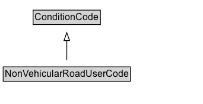

# NonVehicularRoadUserCode

A code that indicates categories of non-vehicular road users that can affect the applicability of a regulation.

EXAMPLE: pedestrian, horse, cattle, etc.

## Diagram

=== "SVG (interactive)"

    <!-- Generated by graphviz version 14.1.3 (20260303.0454)
     -->
    <!-- Pages: 1 -->
    <svg width="256pt" height="132pt"
     viewBox="0.00 0.00 256.00 132.00" xmlns="http://www.w3.org/2000/svg" xmlns:xlink="http://www.w3.org/1999/xlink">
    <g id="graph0" class="graph" transform="scale(1 1) rotate(0) translate(4 128)">
    <polygon fill="white" stroke="none" points="-4,4 -4,-128 252.38,-128 252.38,4 -4,4"/>
    <g id="clust3" class="cluster">
    <title>cluster_associated</title>
    </g>
    <!-- ConditionCode -->
    <g id="node1" class="node">
    <title>ConditionCode</title>
    <g id="a_node1"><a xlink:href="../ConditionCode" xlink:title="&lt;TABLE&gt;">
    <polygon fill="lightgray" stroke="none" points="38.88,-97.88 38.88,-114.12 121.88,-114.12 121.88,-97.88 38.88,-97.88"/>
    <text xml:space="preserve" text-anchor="start" x="39.88" y="-101.88" font-family="Arial" font-size="12.00">ConditionCode</text>
    <polygon fill="none" stroke="black" points="37.88,-96.88 37.88,-115.12 122.88,-115.12 122.88,-96.88 37.88,-96.88"/>
    </a>
    </g>
    </g>
    <!-- NonVehicularRoadUserCode -->
    <g id="node2" class="node">
    <title>NonVehicularRoadUserCode</title>
    <g id="a_node2"><a xlink:href="../NonVehicularRoadUserCode" xlink:title="&lt;TABLE&gt;">
    <polygon fill="lightgray" stroke="none" points="1,-25.88 1,-42.12 159.75,-42.12 159.75,-25.88 1,-25.88"/>
    <text xml:space="preserve" text-anchor="start" x="2" y="-29.88" font-family="Arial" font-size="12.00">NonVehicularRoadUserCode</text>
    <polygon fill="none" stroke="black" points="0,-24.88 0,-43.12 160.75,-43.12 160.75,-24.88 0,-24.88"/>
    </a>
    </g>
    </g>
    <!-- NonVehicularRoadUserCode&#45;&gt;ConditionCode -->
    <g id="edge1" class="edge">
    <title>NonVehicularRoadUserCode&#45;&gt;ConditionCode</title>
    <path fill="none" stroke="black" d="M80.38,-51.79C80.38,-59.25 80.38,-68.24 80.38,-76.69"/>
    <polygon fill="none" stroke="black" points="76.88,-76.54 80.38,-86.54 83.88,-76.54 76.88,-76.54"/>
    </g>
    <!-- Invis -->
    </g>
    </svg>

=== "PNG"

    

## Formalization for NonVehicularRoadUserCode

| Property | Constraint |
|----------|------------|
| subClassOf | [ConditionCode](ConditionCode.md) |

## Other annotations

| Property | Value |
|----------|-------|
| [rdfs:seeAlso](https://w3id.org/citydata/imported/rdfs/seeAlso) | DATEX-II NonVehicularRoadUserTypeEnum |

