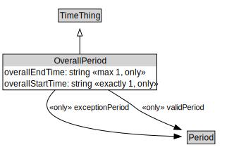

# OverallPeriod

<a href="../../diagrams/OverallPeriod.svg">Open interactive OverallPeriod diagram</a>

## Formalization

| Property | Value Restriction | Definition |
|----------|-------------------|------------|
| exceptionPeriod | only [Period](Period.md) | None |
| overallEndTime | max 1 xsd:dateTime | None |
| overallEndTime | only xsd:dateTime | None |
| overallStartTime | exactly 1 xsd:dateTime | None |
| overallStartTime | only xsd:dateTime | None |
| rdfs:subClassOf | [TimeThing](TimeThing.md) | --- |
| validPeriod | only [Period](Period.md) | None |

## Other Annotations

- **xsd:pattern**: [TimePattern](TimePattern.md)

