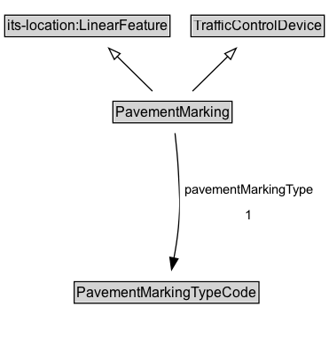

# PavementMarking

A device that is used to mark the pavement, such as lines, symbols, or text.

## Diagram

=== "SVG (interactive)"

    <!-- Generated by graphviz version 14.1.3 (20260303.0454)
     -->
    <!-- Pages: 1 -->
    <svg width="278pt" height="286pt"
     viewBox="0.00 0.00 278.00 286.00" xmlns="http://www.w3.org/2000/svg" xmlns:xlink="http://www.w3.org/1999/xlink">
    <g id="graph0" class="graph" transform="scale(1 1) rotate(0) translate(4 282)">
    <polygon fill="white" stroke="none" points="-4,4 -4,-282 274.25,-282 274.25,4 -4,4"/>
    <g id="clust3" class="cluster">
    <title>cluster_associated</title>
    </g>
    <!-- its&#45;location_LinearFeature -->
    <g id="node1" class="node">
    <title>its&#45;location_LinearFeature</title>
    <g id="a_node1"><a xlink:href="https://w3id.org/itsdata/location/v1/LinearFeature" xlink:title="&lt;TABLE&gt;">
    <polygon fill="lightgray" stroke="none" points="1,-251.88 1,-268.12 138.75,-268.12 138.75,-251.88 1,-251.88"/>
    <text xml:space="preserve" text-anchor="start" x="2" y="-255.88" font-family="Arial" font-size="12.00">its&#45;location:LinearFeature</text>
    <polygon fill="none" stroke="black" points="0,-250.88 0,-269.12 139.75,-269.12 139.75,-250.88 0,-250.88"/>
    </a>
    </g>
    </g>
    <!-- TrafficControlDevice -->
    <g id="node2" class="node">
    <title>TrafficControlDevice</title>
    <g id="a_node2"><a xlink:href="../TrafficControlDevice" xlink:title="&lt;TABLE&gt;">
    <polygon fill="lightgray" stroke="none" points="158.5,-251.88 158.5,-268.12 269.25,-268.12 269.25,-251.88 158.5,-251.88"/>
    <text xml:space="preserve" text-anchor="start" x="159.5" y="-255.88" font-family="Arial" font-size="12.00">TrafficControlDevice</text>
    <polygon fill="none" stroke="black" points="157.5,-250.88 157.5,-269.12 270.25,-269.12 270.25,-250.88 157.5,-250.88"/>
    </a>
    </g>
    </g>
    <!-- PavementMarking -->
    <g id="node3" class="node">
    <title>PavementMarking</title>
    <g id="a_node3"><a xlink:href="../PavementMarking" xlink:title="&lt;TABLE&gt;">
    <polygon fill="lightgray" stroke="none" points="92.5,-178.88 92.5,-195.12 191.25,-195.12 191.25,-178.88 92.5,-178.88"/>
    <text xml:space="preserve" text-anchor="start" x="93.5" y="-182.88" font-family="Arial" font-size="12.00">PavementMarking</text>
    <polygon fill="none" stroke="black" points="91.5,-177.88 91.5,-196.12 192.25,-196.12 192.25,-177.88 91.5,-177.88"/>
    </a>
    </g>
    </g>
    <!-- PavementMarking&#45;&gt;its&#45;location_LinearFeature -->
    <g id="edge1" class="edge">
    <title>PavementMarking&#45;&gt;its&#45;location_LinearFeature</title>
    <path fill="none" stroke="black" d="M124.93,-204.71C115.99,-213.53 104.83,-224.53 94.91,-234.31"/>
    <polygon fill="none" stroke="black" points="92.68,-231.6 88.02,-241.11 97.59,-236.58 92.68,-231.6"/>
    </g>
    <!-- PavementMarking&#45;&gt;TrafficControlDevice -->
    <g id="edge2" class="edge">
    <title>PavementMarking&#45;&gt;TrafficControlDevice</title>
    <path fill="none" stroke="black" d="M158.82,-204.71C167.76,-213.53 178.92,-224.53 188.84,-234.31"/>
    <polygon fill="none" stroke="black" points="186.16,-236.58 195.73,-241.11 191.07,-231.6 186.16,-236.58"/>
    </g>
    <!-- Invis -->
    <!-- PavementMarking&#45;&gt;Invis -->
    <!-- PavementMarkingTypeCode -->
    <g id="node5" class="node">
    <title>PavementMarkingTypeCode</title>
    <g id="a_node5"><a xlink:href="../PavementMarkingTypeCode" xlink:title="&lt;TABLE&gt;">
    <polygon fill="lightgray" stroke="none" points="59.75,-25.88 59.75,-42.12 214,-42.12 214,-25.88 59.75,-25.88"/>
    <text xml:space="preserve" text-anchor="start" x="60.75" y="-29.88" font-family="Arial" font-size="12.00">PavementMarkingTypeCode</text>
    <polygon fill="none" stroke="black" points="58.75,-24.88 58.75,-43.12 215,-43.12 215,-24.88 58.75,-24.88"/>
    </a>
    </g>
    </g>
    <!-- PavementMarking&#45;&gt;PavementMarkingTypeCode -->
    <g id="edge5" class="edge">
    <title>PavementMarking&#45;&gt;PavementMarkingTypeCode</title>
    <path fill="none" stroke="black" d="M144.01,-169.08C145.11,-159.53 146.33,-147.37 146.88,-136.5 147.94,-115.42 148.81,-110.02 146.88,-89 146.09,-80.48 144.63,-71.3 143.06,-62.97"/>
    <polygon fill="black" stroke="black" points="146.54,-62.51 141.13,-53.4 139.68,-63.89 146.54,-62.51"/>
    <polygon fill="white" stroke="none" points="148.02,-89 148.02,-132 264.77,-132 264.77,-89 148.02,-89"/>
    <text xml:space="preserve" text-anchor="start" x="152.02" y="-117.5" font-family="Arial" font-size="11.00">pavementMarkingType</text>
    <text xml:space="preserve" text-anchor="start" x="203.39" y="-96" font-family="Arial" font-size="11.00">1</text>
    </g>
    <!-- Invis&#45;&gt;PavementMarkingTypeCode -->
    </g>
    </svg>

=== "PNG"

    

## Formalization for PavementMarking

| Property | Constraint |
|----------|------------|
| [pavementMarkingType](../properties/pavementMarkingType.md) | only [PavementMarkingTypeCode](https://w3id.org/itsdata/regulation/v1/PavementMarkingTypeCode) |
| subClassOf | [TrafficControlDevice](TrafficControlDevice.md) |
| subClassOf | [its-location:LinearFeature](https://w3id.org/itsdata/location/v1/LinearFeature) |

