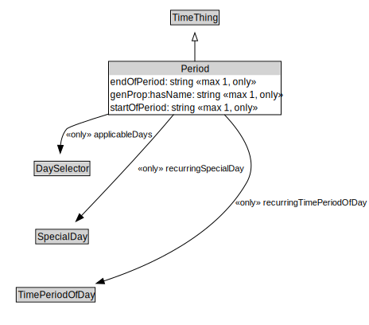

# Period

<a href="../../diagrams/Period.svg">Open interactive Period diagram</a>

## Formalization

| Property | Value Restriction | Definition |
|----------|-------------------|------------|
| applicableDays | only [DaySelector](DaySelector.md) | None |
| endOfPeriod | max 1 xsd:dateTime | None |
| endOfPeriod | only xsd:dateTime | None |
| genProp:hasName | max 1 xsd:string | None |
| genProp:hasName | only xsd:string | None |
| rdfs:subClassOf | [TimeThing](TimeThing.md) | --- |
| recurringSpecialDay | only [SpecialDay](SpecialDay.md) | None |
| recurringTimePeriodOfDay | only [TimePeriodOfDay](TimePeriodOfDay.md) | None |
| startOfPeriod | max 1 xsd:dateTime | None |
| startOfPeriod | only xsd:dateTime | None |

## Other Annotations

- **xsd:pattern**: [TimePattern](TimePattern.md)

