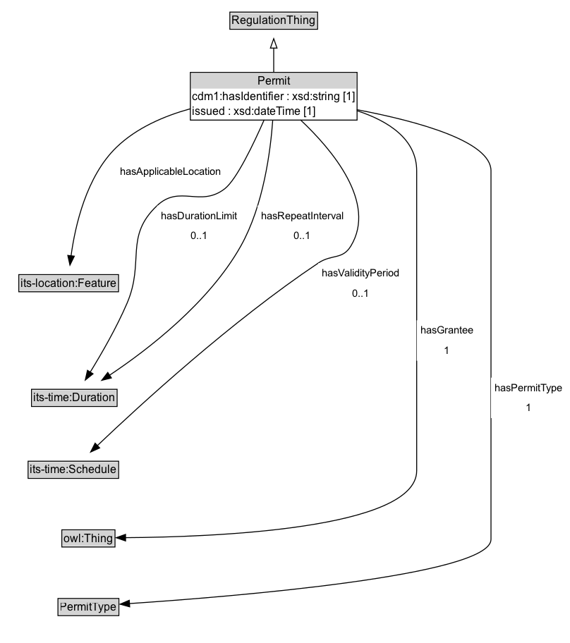

# Permit

Certificate that indicates designations that are associated with the grantee.

## Diagram

=== "SVG (interactive)"

    <!-- Generated by graphviz version 14.1.3 (20260303.0454)
     -->
    <!-- Pages: 1 -->
    <svg width="606pt" height="684pt"
     viewBox="0.00 0.00 606.00 684.00" xmlns="http://www.w3.org/2000/svg" xmlns:xlink="http://www.w3.org/1999/xlink">
    <g id="graph0" class="graph" transform="scale(1 1) rotate(0) translate(4 679.75)">
    <polygon fill="white" stroke="none" points="-4,4 -4,-679.75 602,-679.75 602,4 -4,4"/>
    <g id="clust3" class="cluster">
    <title>cluster_associated</title>
    </g>
    <!-- RegulationThing -->
    <g id="node1" class="node">
    <title>RegulationThing</title>
    <g id="a_node1"><a xlink:href="../RegulationThing" xlink:title="&lt;TABLE&gt;">
    <polygon fill="lightgray" stroke="none" points="241.38,-649.62 241.38,-665.88 332.62,-665.88 332.62,-649.62 241.38,-649.62"/>
    <text xml:space="preserve" text-anchor="start" x="242.38" y="-653.62" font-family="Arial" font-size="12.00">RegulationThing</text>
    <polygon fill="none" stroke="black" points="240.38,-648.62 240.38,-666.88 333.62,-666.88 333.62,-648.62 240.38,-648.62"/>
    </a>
    </g>
    </g>
    <!-- Permit -->
    <g id="node2" class="node">
    <title>Permit</title>
    <g id="a_node2"><a xlink:href="../Permit" xlink:title="&lt;TABLE&gt;">
    <polygon fill="lightgray" stroke="none" points="199.38,-585.5 199.38,-601.75 374.62,-601.75 374.62,-585.5 199.38,-585.5"/>
    <text xml:space="preserve" text-anchor="start" x="269.75" y="-589.5" font-family="Arial" font-size="12.00">Permit</text>
    <text xml:space="preserve" text-anchor="start" x="200.38" y="-573.25" font-family="Arial" font-size="12.00">cdm1:hasIdentifier : xsd:string [1]</text>
    <text xml:space="preserve" text-anchor="start" x="200.38" y="-557" font-family="Arial" font-size="12.00">issued : xsd:dateTime [1]</text>
    <polygon fill="none" stroke="black" points="198.38,-552 198.38,-602.75 375.62,-602.75 375.62,-552 198.38,-552"/>
    </a>
    </g>
    </g>
    <!-- Permit&#45;&gt;RegulationThing -->
    <g id="edge1" class="edge">
    <title>Permit&#45;&gt;RegulationThing</title>
    <path fill="none" stroke="black" d="M287,-602.71C287,-610.97 287,-620.27 287,-628.79"/>
    <polygon fill="none" stroke="black" points="283.5,-628.62 287,-638.62 290.5,-628.62 283.5,-628.62"/>
    </g>
    <!-- Invis -->
    <!-- Permit&#45;&gt;Invis -->
    <!-- its&#45;location_Feature -->
    <g id="node4" class="node">
    <title>its&#45;location_Feature</title>
    <g id="a_node4"><a xlink:href="https://w3id.org/itsdata/location/v1/Feature" xlink:title="&lt;TABLE&gt;">
    <polygon fill="lightgray" stroke="none" points="17,-370.38 17,-386.62 121,-386.62 121,-370.38 17,-370.38"/>
    <text xml:space="preserve" text-anchor="start" x="18" y="-374.38" font-family="Arial" font-size="12.00">its&#45;location:Feature</text>
    <polygon fill="none" stroke="black" points="16,-369.38 16,-387.62 122,-387.62 122,-369.38 16,-369.38"/>
    </a>
    </g>
    </g>
    <!-- Permit&#45;&gt;its&#45;location_Feature -->
    <g id="edge9" class="edge">
    <title>Permit&#45;&gt;its&#45;location_Feature</title>
    <path fill="none" stroke="black" d="M198.59,-564.12C170.43,-556.36 141.09,-543.68 119.75,-523 87.78,-492.01 75.91,-439.66 71.53,-407.48"/>
    <polygon fill="black" stroke="black" points="75.03,-407.25 70.37,-397.73 68.08,-408.07 75.03,-407.25"/>
    <polygon fill="white" stroke="none" points="119.75,-486.25 119.75,-507.75 235,-507.75 235,-486.25 119.75,-486.25"/>
    <text xml:space="preserve" text-anchor="start" x="123.75" y="-493.25" font-family="Arial" font-size="11.00">hasApplicableLocation</text>
    </g>
    <!-- its&#45;time_Duration -->
    <g id="node5" class="node">
    <title>its&#45;time_Duration</title>
    <g id="a_node5"><a xlink:href="https://w3id.org/itsdata/time/v1/Duration" xlink:title="&lt;TABLE&gt;">
    <polygon fill="lightgray" stroke="none" points="30.5,-248.38 30.5,-264.62 119.5,-264.62 119.5,-248.38 30.5,-248.38"/>
    <text xml:space="preserve" text-anchor="start" x="31.5" y="-252.38" font-family="Arial" font-size="12.00">its&#45;time:Duration</text>
    <polygon fill="none" stroke="black" points="29.5,-247.38 29.5,-265.62 120.5,-265.62 120.5,-247.38 29.5,-247.38"/>
    </a>
    </g>
    </g>
    <!-- Permit&#45;&gt;its&#45;time_Duration -->
    <g id="edge10" class="edge">
    <title>Permit&#45;&gt;its&#45;time_Duration</title>
    <path fill="none" stroke="black" d="M276.89,-552.36C265.68,-526.82 247.54,-488.79 235,-479 209,-458.71 186.94,-483.69 163,-461 127.9,-427.73 150.08,-401.44 131,-357 119.93,-331.22 103.98,-303.52 91.93,-283.92"/>
    <polygon fill="black" stroke="black" points="94.93,-282.1 86.66,-275.47 88.99,-285.81 94.93,-282.1"/>
    <polygon fill="white" stroke="none" points="163,-418 163,-461 252,-461 252,-418 163,-418"/>
    <text xml:space="preserve" text-anchor="start" x="167" y="-446.5" font-family="Arial" font-size="11.00">hasDurationLimit</text>
    <text xml:space="preserve" text-anchor="start" x="198.5" y="-425" font-family="Arial" font-size="11.00">0..1</text>
    </g>
    <!-- Permit&#45;&gt;its&#45;time_Duration -->
    <g id="edge12" class="edge">
    <title>Permit&#45;&gt;its&#45;time_Duration</title>
    <path fill="none" stroke="black" d="M285.97,-552.03C283.66,-519.53 276.19,-461.09 252,-418 218.17,-357.72 153.38,-307.91 112.28,-280.48"/>
    <polygon fill="black" stroke="black" points="114.42,-277.7 104.14,-275.15 110.59,-283.56 114.42,-277.7"/>
    <polygon fill="white" stroke="none" points="269.7,-418 269.7,-461 365.45,-461 365.45,-418 269.7,-418"/>
    <text xml:space="preserve" text-anchor="start" x="273.7" y="-446.5" font-family="Arial" font-size="11.00">hasRepeatInterval</text>
    <text xml:space="preserve" text-anchor="start" x="308.58" y="-425" font-family="Arial" font-size="11.00">0..1</text>
    </g>
    <!-- its&#45;time_Schedule -->
    <g id="node6" class="node">
    <title>its&#45;time_Schedule</title>
    <g id="a_node6"><a xlink:href="https://w3id.org/itsdata/time/v1/Schedule" xlink:title="&lt;TABLE&gt;">
    <polygon fill="lightgray" stroke="none" points="26.88,-171.88 26.88,-188.12 121.12,-188.12 121.12,-171.88 26.88,-171.88"/>
    <text xml:space="preserve" text-anchor="start" x="27.88" y="-175.88" font-family="Arial" font-size="12.00">its&#45;time:Schedule</text>
    <polygon fill="none" stroke="black" points="25.88,-170.88 25.88,-189.12 122.12,-189.12 122.12,-170.88 25.88,-170.88"/>
    </a>
    </g>
    </g>
    <!-- Permit&#45;&gt;its&#45;time_Schedule -->
    <g id="edge13" class="edge">
    <title>Permit&#45;&gt;its&#45;time_Schedule</title>
    <path fill="none" stroke="black" d="M315.45,-552.22C349.01,-520.68 396.93,-464.07 369,-418 360.03,-403.21 348.87,-409.62 334.5,-400 241.98,-338.06 144.52,-248.65 99.52,-205.77"/>
    <polygon fill="black" stroke="black" points="101.98,-203.27 92.33,-198.88 97.13,-208.32 101.98,-203.27"/>
    <polygon fill="white" stroke="none" points="334.5,-357 334.5,-400 425,-400 425,-357 334.5,-357"/>
    <text xml:space="preserve" text-anchor="start" x="338.5" y="-385.5" font-family="Arial" font-size="11.00">hasValidityPeriod</text>
    <text xml:space="preserve" text-anchor="start" x="370.75" y="-364" font-family="Arial" font-size="11.00">0..1</text>
    </g>
    <!-- owl_Thing -->
    <g id="node7" class="node">
    <title>owl_Thing</title>
    <g id="a_node7"><a xlink:href="https://w3id.org/citydata/imported/owl/latest/Thing" xlink:title="&lt;TABLE&gt;">
    <polygon fill="lightgray" stroke="none" points="62.75,-98.88 62.75,-115.12 117.25,-115.12 117.25,-98.88 62.75,-98.88"/>
    <text xml:space="preserve" text-anchor="start" x="63.75" y="-102.88" font-family="Arial" font-size="12.00">owl:Thing</text>
    <polygon fill="none" stroke="black" points="61.75,-97.88 61.75,-116.12 118.25,-116.12 118.25,-97.88 61.75,-97.88"/>
    </a>
    </g>
    </g>
    <!-- Permit&#45;&gt;owl_Thing -->
    <g id="edge11" class="edge">
    <title>Permit&#45;&gt;owl_Thing</title>
    <path fill="none" stroke="black" d="M375.42,-562.03C408.86,-551.09 439,-531.85 439,-498 439,-498 439,-498 439,-179 439,-116.42 220.82,-108.42 129.48,-107.8"/>
    <polygon fill="black" stroke="black" points="129.5,-104.3 119.48,-107.77 129.47,-111.3 129.5,-104.3"/>
    <polygon fill="white" stroke="none" points="439,-296 439,-339 503.25,-339 503.25,-296 439,-296"/>
    <text xml:space="preserve" text-anchor="start" x="443" y="-324.5" font-family="Arial" font-size="11.00">hasGrantee</text>
    <text xml:space="preserve" text-anchor="start" x="468.12" y="-303" font-family="Arial" font-size="11.00">1</text>
    </g>
    <!-- PermitType -->
    <g id="node8" class="node">
    <title>PermitType</title>
    <g id="a_node8"><a xlink:href="../PermitType" xlink:title="&lt;TABLE&gt;">
    <polygon fill="lightgray" stroke="none" points="58.62,-25.88 58.62,-42.12 121.38,-42.12 121.38,-25.88 58.62,-25.88"/>
    <text xml:space="preserve" text-anchor="start" x="59.62" y="-29.88" font-family="Arial" font-size="12.00">PermitType</text>
    <polygon fill="none" stroke="black" points="57.62,-24.88 57.62,-43.12 122.38,-43.12 122.38,-24.88 57.62,-24.88"/>
    </a>
    </g>
    </g>
    <!-- Permit&#45;&gt;PermitType -->
    <g id="edge8" class="edge">
    <title>Permit&#45;&gt;PermitType</title>
    <path fill="none" stroke="black" d="M375.32,-563.09C440.53,-550.71 518,-529.39 518,-498 518,-498 518,-498 518,-106 518,-67.3 242.17,-44.98 133.38,-37.68"/>
    <polygon fill="black" stroke="black" points="133.89,-34.21 123.68,-37.04 133.43,-41.19 133.89,-34.21"/>
    <polygon fill="white" stroke="none" points="518,-235 518,-278 598,-278 598,-235 518,-235"/>
    <text xml:space="preserve" text-anchor="start" x="522" y="-263.5" font-family="Arial" font-size="11.00">hasPermitType</text>
    <text xml:space="preserve" text-anchor="start" x="555" y="-242" font-family="Arial" font-size="11.00">1</text>
    </g>
    <!-- Invis&#45;&gt;its&#45;location_Feature -->
    <!-- its&#45;location_Feature&#45;&gt;its&#45;time_Duration -->
    <!-- its&#45;time_Duration&#45;&gt;its&#45;time_Schedule -->
    <!-- its&#45;time_Schedule&#45;&gt;owl_Thing -->
    <!-- owl_Thing&#45;&gt;PermitType -->
    </g>
    </svg>

=== "PNG"

    

## Formalization for Permit

| Property | Constraint |
|----------|------------|
| [cdm1:hasIdentifier](https://w3id.org/citydata/part1/v1/hasIdentifier) | exactly 1 |
| [cdm1:hasIdentifier](https://w3id.org/citydata/part1/v1/hasIdentifier) | datatype xsd:string |
| [hasApplicableLocation](../properties/hasApplicableLocation.md) | datatype its-location:Feature |
| [hasDurationLimit](../properties/hasDurationLimit.md) | datatype its-time:Duration |
| [hasPermitType](../properties/hasPermitType.md) | exactly 1 |
| [hasPermitType](../properties/hasPermitType.md) | datatype PermitType |
| [hasRepeatInterval](../properties/hasRepeatInterval.md) | datatype its-time:Duration |
| [hasValidityPeriod](../properties/hasValidityPeriod.md) | datatype its-time:Schedule |
| [issued](../properties/issued.md) | datatype xsd:dateTime |
| subClassOf | [RegulationThing](RegulationThing.md) |

