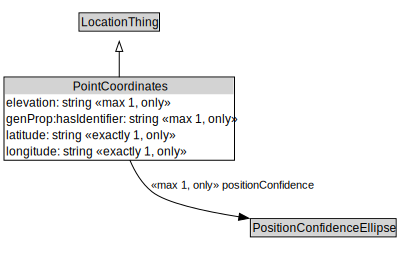

# PointCoordinates

<a href="../../diagrams/PointCoordinates.svg">Open interactive PointCoordinates diagram</a>

## Formalization

| Property | Value Restriction | Definition |
|----------|-------------------|------------|
| elevation | max 1 xsd:float | None |
| elevation | only xsd:float | None |
| genProp:hasIdentifier | max 1 xsd:string | None |
| genProp:hasIdentifier | only xsd:string | None |
| latitude | exactly 1 xsd:float | None |
| latitude | only xsd:float | None |
| longitude | exactly 1 xsd:float | None |
| longitude | only xsd:float | None |
| positionConfidence | max 1 [PositionConfidenceEllipse](PositionConfidenceEllipse.md) | None |
| positionConfidence | only [PositionConfidenceEllipse](PositionConfidenceEllipse.md) | None |
| rdfs:subClassOf | [LocationThing](LocationThing.md) | --- |

## Other Annotations

- **xsd:pattern**: [LocationPattern](LocationPattern.md)

