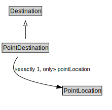

# PointDestination

<a href="../../diagrams/PointDestination.svg">Open interactive PointDestination diagram</a>

## Formalization

| Property | Value Restriction | Definition |
|----------|-------------------|------------|
| pointLocation | exactly 1 [PointLocation](PointLocation.md) | None |
| pointLocation | only [PointLocation](PointLocation.md) | None |
| rdfs:subClassOf | [Destination](Destination.md) | --- |

## Other Annotations

- **xsd:pattern**: [LocationPattern](LocationPattern.md)

