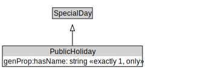

# PublicHoliday

<a href="../../diagrams/PublicHoliday.svg">Open interactive PublicHoliday diagram</a>

## Formalization

| Property | Value Restriction | Definition |
|----------|-------------------|------------|
| genProp:hasName | exactly 1 xsd:string | None |
| genProp:hasName | only xsd:string | None |
| rdfs:subClassOf | [SpecialDay](SpecialDay.md) | --- |

## Other Annotations

- **xsd:pattern**: [TimePattern](TimePattern.md)

