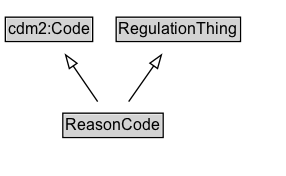

# ReasonCode

A code indicating the reason for the traffic regulation order.

EXAMPLE: construction, maintenance, special event, emergency, weather

## Diagram

=== "SVG (interactive)"

    <!-- Generated by graphviz version 14.1.3 (20260303.0454)
     -->
    <!-- Pages: 1 -->
    <svg width="215pt" height="132pt"
     viewBox="0.00 0.00 215.00 132.00" xmlns="http://www.w3.org/2000/svg" xmlns:xlink="http://www.w3.org/1999/xlink">
    <g id="graph0" class="graph" transform="scale(1 1) rotate(0) translate(4 128)">
    <polygon fill="white" stroke="none" points="-4,4 -4,-128 210.75,-128 210.75,4 -4,4"/>
    <g id="clust3" class="cluster">
    <title>cluster_associated</title>
    </g>
    <!-- cdm2_Code -->
    <g id="node1" class="node">
    <title>cdm2_Code</title>
    <g id="a_node1"><a xlink:href="https://w3id.org/citydata/part2/v1/Code" xlink:title="&lt;TABLE&gt;">
    <polygon fill="lightgray" stroke="none" points="1,-97.88 1,-114.12 64.5,-114.12 64.5,-97.88 1,-97.88"/>
    <text xml:space="preserve" text-anchor="start" x="2" y="-101.88" font-family="Arial" font-size="12.00">cdm2:Code</text>
    <polygon fill="none" stroke="black" points="0,-96.88 0,-115.12 65.5,-115.12 65.5,-96.88 0,-96.88"/>
    </a>
    </g>
    </g>
    <!-- RegulationThing -->
    <g id="node2" class="node">
    <title>RegulationThing</title>
    <g id="a_node2"><a xlink:href="../RegulationThing" xlink:title="&lt;TABLE&gt;">
    <polygon fill="lightgray" stroke="none" points="84.12,-97.88 84.12,-114.12 175.38,-114.12 175.38,-97.88 84.12,-97.88"/>
    <text xml:space="preserve" text-anchor="start" x="85.12" y="-101.88" font-family="Arial" font-size="12.00">RegulationThing</text>
    <polygon fill="none" stroke="black" points="83.12,-96.88 83.12,-115.12 176.38,-115.12 176.38,-96.88 83.12,-96.88"/>
    </a>
    </g>
    </g>
    <!-- ReasonCode -->
    <g id="node3" class="node">
    <title>ReasonCode</title>
    <g id="a_node3"><a xlink:href="../ReasonCode" xlink:title="&lt;TABLE&gt;">
    <polygon fill="lightgray" stroke="none" points="44.12,-25.88 44.12,-42.12 117.38,-42.12 117.38,-25.88 44.12,-25.88"/>
    <text xml:space="preserve" text-anchor="start" x="45.12" y="-29.88" font-family="Arial" font-size="12.00">ReasonCode</text>
    <polygon fill="none" stroke="black" points="43.12,-24.88 43.12,-43.12 118.38,-43.12 118.38,-24.88 43.12,-24.88"/>
    </a>
    </g>
    </g>
    <!-- ReasonCode&#45;&gt;cdm2_Code -->
    <g id="edge1" class="edge">
    <title>ReasonCode&#45;&gt;cdm2_Code</title>
    <path fill="none" stroke="black" d="M69.24,-51.79C63.71,-59.85 56.96,-69.69 50.77,-78.71"/>
    <polygon fill="none" stroke="black" points="47.99,-76.58 45.23,-86.81 53.77,-80.54 47.99,-76.58"/>
    </g>
    <!-- ReasonCode&#45;&gt;RegulationThing -->
    <g id="edge2" class="edge">
    <title>ReasonCode&#45;&gt;RegulationThing</title>
    <path fill="none" stroke="black" d="M92.5,-51.79C98.14,-59.85 105.04,-69.69 111.35,-78.71"/>
    <polygon fill="none" stroke="black" points="108.42,-80.63 117.02,-86.82 114.15,-76.62 108.42,-80.63"/>
    </g>
    <!-- Invis -->
    </g>
    </svg>

=== "PNG"

    

## Formalization for ReasonCode

| Property | Constraint |
|----------|------------|
| subClassOf | [RegulationThing](RegulationThing.md) |
| subClassOf | [cdm2:Code](https://w3id.org/citydata/part2/v1/Code) |

