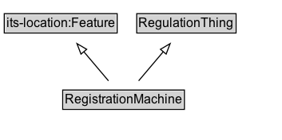

# RegistrationMachine

A machine that is used to register the permit.

## Diagram

=== "SVG (interactive)"

    <!-- Generated by graphviz version 14.1.3 (20260303.0454)
     -->
    <!-- Pages: 1 -->
    <svg width="265pt" height="132pt"
     viewBox="0.00 0.00 265.00 132.00" xmlns="http://www.w3.org/2000/svg" xmlns:xlink="http://www.w3.org/1999/xlink">
    <g id="graph0" class="graph" transform="scale(1 1) rotate(0) translate(4 128)">
    <polygon fill="white" stroke="none" points="-4,4 -4,-128 261,-128 261,4 -4,4"/>
    <g id="clust3" class="cluster">
    <title>cluster_associated</title>
    </g>
    <!-- its&#45;location_Feature -->
    <g id="node1" class="node">
    <title>its&#45;location_Feature</title>
    <g id="a_node1"><a xlink:href="https://w3id.org/itsdata/location/v1/Feature" xlink:title="&lt;TABLE&gt;">
    <polygon fill="lightgray" stroke="none" points="1,-97.88 1,-114.12 105,-114.12 105,-97.88 1,-97.88"/>
    <text xml:space="preserve" text-anchor="start" x="2" y="-101.88" font-family="Arial" font-size="12.00">its&#45;location:Feature</text>
    <polygon fill="none" stroke="black" points="0,-96.88 0,-115.12 106,-115.12 106,-96.88 0,-96.88"/>
    </a>
    </g>
    </g>
    <!-- RegulationThing -->
    <g id="node2" class="node">
    <title>RegulationThing</title>
    <g id="a_node2"><a xlink:href="../RegulationThing" xlink:title="&lt;TABLE&gt;">
    <polygon fill="lightgray" stroke="none" points="125.38,-97.88 125.38,-114.12 216.62,-114.12 216.62,-97.88 125.38,-97.88"/>
    <text xml:space="preserve" text-anchor="start" x="126.38" y="-101.88" font-family="Arial" font-size="12.00">RegulationThing</text>
    <polygon fill="none" stroke="black" points="124.38,-96.88 124.38,-115.12 217.62,-115.12 217.62,-96.88 124.38,-96.88"/>
    </a>
    </g>
    </g>
    <!-- RegistrationMachine -->
    <g id="node3" class="node">
    <title>RegistrationMachine</title>
    <g id="a_node3"><a xlink:href="../RegistrationMachine" xlink:title="&lt;TABLE&gt;">
    <polygon fill="lightgray" stroke="none" points="55.88,-25.88 55.88,-42.12 168.12,-42.12 168.12,-25.88 55.88,-25.88"/>
    <text xml:space="preserve" text-anchor="start" x="56.88" y="-29.88" font-family="Arial" font-size="12.00">RegistrationMachine</text>
    <polygon fill="none" stroke="black" points="54.88,-24.88 54.88,-43.12 169.12,-43.12 169.12,-24.88 54.88,-24.88"/>
    </a>
    </g>
    </g>
    <!-- RegistrationMachine&#45;&gt;its&#45;location_Feature -->
    <g id="edge1" class="edge">
    <title>RegistrationMachine&#45;&gt;its&#45;location_Feature</title>
    <path fill="none" stroke="black" d="M97.85,-51.79C90.91,-60.02 82.4,-70.11 74.67,-79.29"/>
    <polygon fill="none" stroke="black" points="72.03,-77 68.26,-86.9 77.38,-81.51 72.03,-77"/>
    </g>
    <!-- RegistrationMachine&#45;&gt;RegulationThing -->
    <g id="edge2" class="edge">
    <title>RegistrationMachine&#45;&gt;RegulationThing</title>
    <path fill="none" stroke="black" d="M126.15,-51.79C133.09,-60.02 141.6,-70.11 149.33,-79.29"/>
    <polygon fill="none" stroke="black" points="146.62,-81.51 155.74,-86.9 151.97,-77 146.62,-81.51"/>
    </g>
    <!-- Invis -->
    </g>
    </svg>

=== "PNG"

    

## Formalization for RegistrationMachine

| Property | Constraint |
|----------|------------|
| subClassOf | [RegulationThing](RegulationThing.md) |
| subClassOf | [its-location:Feature](https://w3id.org/itsdata/location/v1/Feature) |

