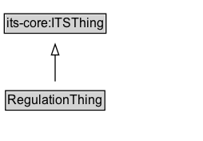

# RegulationThing

A class to organize all classes defined in the Traffic Regulation topic area of the ITS Ontology.

## Diagram

=== "SVG (interactive)"

    <!-- Generated by graphviz version 14.1.3 (20260303.0454)
     -->
    <!-- Pages: 1 -->
    <svg width="191pt" height="132pt"
     viewBox="0.00 0.00 191.00 132.00" xmlns="http://www.w3.org/2000/svg" xmlns:xlink="http://www.w3.org/1999/xlink">
    <g id="graph0" class="graph" transform="scale(1 1) rotate(0) translate(4 128)">
    <polygon fill="white" stroke="none" points="-4,4 -4,-128 186.75,-128 186.75,4 -4,4"/>
    <g id="clust3" class="cluster">
    <title>cluster_associated</title>
    </g>
    <!-- its&#45;core_ITSThing -->
    <g id="node1" class="node">
    <title>its&#45;core_ITSThing</title>
    <g id="a_node1"><a xlink:href="https://w3id.org/itsdata/core/v1/ITSThing" xlink:title="&lt;TABLE&gt;">
    <polygon fill="lightgray" stroke="none" points="1,-97.88 1,-114.12 94.5,-114.12 94.5,-97.88 1,-97.88"/>
    <text xml:space="preserve" text-anchor="start" x="2" y="-101.88" font-family="Arial" font-size="12.00">its&#45;core:ITSThing</text>
    <polygon fill="none" stroke="black" points="0,-96.88 0,-115.12 95.5,-115.12 95.5,-96.88 0,-96.88"/>
    </a>
    </g>
    </g>
    <!-- RegulationThing -->
    <g id="node2" class="node">
    <title>RegulationThing</title>
    <g id="a_node2"><a xlink:href="../RegulationThing" xlink:title="&lt;TABLE&gt;">
    <polygon fill="lightgray" stroke="none" points="2.12,-25.88 2.12,-42.12 93.38,-42.12 93.38,-25.88 2.12,-25.88"/>
    <text xml:space="preserve" text-anchor="start" x="3.12" y="-29.88" font-family="Arial" font-size="12.00">RegulationThing</text>
    <polygon fill="none" stroke="black" points="1.12,-24.88 1.12,-43.12 94.38,-43.12 94.38,-24.88 1.12,-24.88"/>
    </a>
    </g>
    </g>
    <!-- RegulationThing&#45;&gt;its&#45;core_ITSThing -->
    <g id="edge1" class="edge">
    <title>RegulationThing&#45;&gt;its&#45;core_ITSThing</title>
    <path fill="none" stroke="black" d="M47.75,-51.79C47.75,-59.25 47.75,-68.24 47.75,-76.69"/>
    <polygon fill="none" stroke="black" points="44.25,-76.54 47.75,-86.54 51.25,-76.54 44.25,-76.54"/>
    </g>
    <!-- Invis -->
    </g>
    </svg>

=== "PNG"

    

## Specializations of RegulationThing

| Class | Description |
|-------|-------------|
| [Access Control Device](AccessControlDevice.md) | A device that is used to control access to a specific area, such as a gate or barrier. |
| [Activation Status Code](ActivationStatusCode.md) | A code indicating the activation status of an object |
| [Channelization Device](ChannelizationDevice.md) | A device that is used to guide or direct traffic, such as a curb or a series of cones, barrels, or barricades. |
| [Coded Pair Regulation](CodedPairRegulation.md) | A restriction defined by a code. |
| [Coded Regulation](CodedRegulation.md) | A restriction defined by a code. |
| [Coded Regulation With Fee](CodedRegulationWithFee.md) | A condition defined by a code. |
| [Coded Regulation With Threshold](CodedRegulationWithThreshold.md) | A restriction defined by a code coupled with a threshold value. |
| [Code Pair Regulation Code](CodePairRegulationCode.md) | A code indicating the type of regulation that is associated with a code pair. |
| [Composite Sign](CompositeSign.md) | A single traffic-control unit whose content is an ordered sequence of one or more SimpleSigns, represented as an rdf:List: rdf:first is the main sign, and each rdf:rest step is the next panel in order (for example supplemental signs). |
| [Condition](Condition.md) | A boolean condition that must evaluate to true for the associated regulation(s) to currently apply. Even if the condition is true, it is not active if it is currently overridden. The condition may be multi-part. |
| [Condition Set](ConditionSet.md) | A composite condition that consists of two or more Conditions combined by a logical operator; the set must evaluate to true for the associated regulation(s) to currently apply. |
| [Context Regulation Code](ContextRegulationCode.md) | A code indicating the context of a regulation that is associated with a code pair. |
| [Enumerated Condition](EnumeratedCondition.md) | A condition that is based on an enumerated value in a known code list. |
| [Fee Regulation Code](FeeRegulationCode.md) | A code indicating the type of regulation that is associated with a fee schedule. |
| [International Sign](InternationalSign.md) | A traffic control device that is used to convey information to road users, such as regulatory, warning, or guide signs. |
| [Legal Basis](LegalBasis.md) | A legal basis provides references to the legal documents that authorize an entity to issue the types of regulations covered by a traffic regulation order. |
| [Location Condition](LocationCondition.md) | A condition that applies to a specific location. |
| [Measurable Condition](MeasurableCondition.md) | A condition that is based on a comparison between a measurable value and a threshold value. |
| [Pavement Marking](PavementMarking.md) | A device that is used to mark the pavement, such as lines, symbols, or text. |
| [Permit](Permit.md) | Certificate that indicates designations that are associated with the grantee. |
| [Permit Application Information](PermitApplicationInformation.md) | Details about the application of the permit. |
| [Permit Designation Code](PermitDesignationCode.md) | A code that indicates the designation of the permit. |
| [Permit Display Type Code](PermitDisplayTypeCode.md) | A code that indicates the type of display that is associated with the permit. |
| [Permit Grantee Type Code](PermitGranteeTypeCode.md) | A code that indicates the type of grantee of the permit. |
| [Permit Grantor Type Code](PermitGrantorTypeCode.md) | A code that indicates the type of grantor of the permit. |
| [Permit Required Condition](PermitRequiredCondition.md) | A condition that is based on the possession of a permit. |
| [Permit Type](PermitType.md) | A category of certificate that the grantor is able to issue to designate a grantee as a specific type of entity. |
| [Reason Code](ReasonCode.md) | A code indicating the reason for the traffic regulation order. |
| [Registration Machine](RegistrationMachine.md) | A machine that is used to register the permit. |
| [Regulation Code](RegulationCode.md) |  |
| [Regulatory Scope Code](RegulatoryScopeCode.md) | A code indicating the regulatory scope of a rule maker role. |
| [Road Surface Feature](RoadSurfaceFeature.md) | A traffic control device that changes the nature of the road surface, such as rumble strips or speed bumps. |
| [Rule Maker Role](RuleMakerRole.md) | A Role that includes the responsibility for creating and maintaining rules of the road or regulations for a geographic and operational scope as defined by the parent jurisdictional entity. |
| [Sign Destination](SignDestination.md) | A destination that is indicated on the road sign. |
| [Simple Sign](SimpleSign.md) | A traffic control device that consists of a single message conveyed by a single pictogram. |
| [Stand Alone Regulation Code](StandAloneRegulationCode.md) | A code indicating the type of regulation that does not require any supplemental information. |
| [Textual Regulation](TextualRegulation.md) | A textual regulation is a rule having the force of law that is established by a regulator through a traffic regulation order. |
| [Threshold Regulation Code](ThresholdRegulationCode.md) | A code indicating the type of regulation that requires a threshold value. |
| [Time Validity Condition](TimeValidityCondition.md) | A condition that applies to a specific location. |
| [Traffic Control Device](TrafficControlDevice.md) | A device that is used to control traffic, such as a road sign, traffic signal, or pavement marking. |
| [Traffic Regulation](TrafficRegulation.md) | A traffic regulation is a rule having the force of law that is established by a regulator through a traffic regulation order. |
| [Traffic Regulation Order](TrafficRegulationOrder.md) | A legally recognized document or publication issued to enact a specific traffic regulation or regulations by a competent authority. |
| [Traffic Signal](TrafficSignal.md) | A traffic control device that is used to control traffic flow at intersections or pedestrian crossings using lights. |
| [Traffic Signal Device](TrafficSignalDevice.md) | A device that is used to control traffic signals, including traffic lights and warning beacons. |
| [Tro Status Code](TroStatusCode.md) | A code indicating the lifecycle status of a traffic regulation order |
| [Versioned Condition](VersionedCondition.md) | A specific version of a condition that can be referenced by a ConditionReference. |
| [Warning Beacon](WarningBeacon.md) | A device that is used to warn road users of potential hazards or to draw attention to specific conditions using lights or signals. |

## Formalization for RegulationThing

| Property | Constraint |
|----------|------------|
| subClassOf | [its-core:ITSThing](its-core:ITSThing.md) |

## Other annotations

| Property | Value |
|----------|-------|
| [dash:abstract](https://w3id.org/citydata/imported/dash/abstract) | true |

