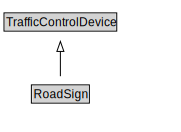

# RoadSign

<a href="../../diagrams/RoadSign.svg">Open interactive RoadSign diagram</a>

## Formalization for RoadSign

| Property | Value Restriction | Definition |
|----------|-------------------|------------|
| rdfs:subClassOf | [TrafficControlDevice](TrafficControlDevice.md) | --- |

## Other Annotations

- **xsd::pattern**: TroPattern

