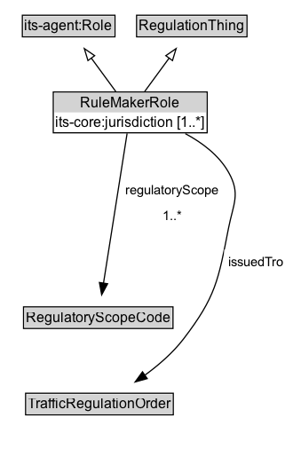

# RuleMakerRole

A Role that includes the responsibility for creating and maintaining rules of the road or regulations for a geographic and operational scope as defined by the parent jurisdictional entity.

## Diagram

=== "SVG (interactive)"

    <!-- Generated by graphviz version 14.1.3 (20260303.0454)
     -->
    <!-- Pages: 1 -->
    <svg width="248pt" height="380pt"
     viewBox="0.00 0.00 248.00 380.00" xmlns="http://www.w3.org/2000/svg" xmlns:xlink="http://www.w3.org/1999/xlink">
    <g id="graph0" class="graph" transform="scale(1 1) rotate(0) translate(4 375.5)">
    <polygon fill="white" stroke="none" points="-4,4 -4,-375.5 243.87,-375.5 243.87,4 -4,4"/>
    <g id="clust3" class="cluster">
    <title>cluster_associated</title>
    </g>
    <!-- its&#45;agent_Role -->
    <g id="node1" class="node">
    <title>its&#45;agent_Role</title>
    <g id="a_node1"><a xlink:href="https://w3id.org/itsdata/agent/v1/Role" xlink:title="&lt;TABLE&gt;">
    <polygon fill="lightgray" stroke="none" points="15.88,-345.38 15.88,-361.62 92.12,-361.62 92.12,-345.38 15.88,-345.38"/>
    <text xml:space="preserve" text-anchor="start" x="16.88" y="-349.38" font-family="Arial" font-size="12.00">its&#45;agent:Role</text>
    <polygon fill="none" stroke="black" points="14.88,-344.38 14.88,-362.62 93.12,-362.62 93.12,-344.38 14.88,-344.38"/>
    </a>
    </g>
    </g>
    <!-- RegulationThing -->
    <g id="node2" class="node">
    <title>RegulationThing</title>
    <g id="a_node2"><a xlink:href="../RegulationThing" xlink:title="&lt;TABLE&gt;">
    <polygon fill="lightgray" stroke="none" points="112.38,-345.38 112.38,-361.62 203.62,-361.62 203.62,-345.38 112.38,-345.38"/>
    <text xml:space="preserve" text-anchor="start" x="113.38" y="-349.38" font-family="Arial" font-size="12.00">RegulationThing</text>
    <polygon fill="none" stroke="black" points="111.38,-344.38 111.38,-362.62 204.62,-362.62 204.62,-344.38 111.38,-344.38"/>
    </a>
    </g>
    </g>
    <!-- RuleMakerRole -->
    <g id="node3" class="node">
    <title>RuleMakerRole</title>
    <g id="a_node3"><a xlink:href="../RuleMakerRole" xlink:title="&lt;TABLE&gt;">
    <polygon fill="lightgray" stroke="none" points="42,-280.5 42,-296.75 170,-296.75 170,-280.5 42,-280.5"/>
    <text xml:space="preserve" text-anchor="start" x="64" y="-284.5" font-family="Arial" font-size="12.00">RuleMakerRole</text>
    <text xml:space="preserve" text-anchor="start" x="43" y="-268.25" font-family="Arial" font-size="12.00">its&#45;core:jurisdiction [1..&#42;]</text>
    <polygon fill="none" stroke="black" points="41,-263.25 41,-297.75 171,-297.75 171,-263.25 41,-263.25"/>
    </a>
    </g>
    </g>
    <!-- RuleMakerRole&#45;&gt;its&#45;agent_Role -->
    <g id="edge1" class="edge">
    <title>RuleMakerRole&#45;&gt;its&#45;agent_Role</title>
    <path fill="none" stroke="black" d="M93.77,-298.21C87.56,-306.67 79.89,-317.15 72.95,-326.63"/>
    <polygon fill="none" stroke="black" points="70.3,-324.32 67.22,-334.45 75.95,-328.45 70.3,-324.32"/>
    </g>
    <!-- RuleMakerRole&#45;&gt;RegulationThing -->
    <g id="edge2" class="edge">
    <title>RuleMakerRole&#45;&gt;RegulationThing</title>
    <path fill="none" stroke="black" d="M118.23,-298.21C124.44,-306.67 132.11,-317.15 139.05,-326.63"/>
    <polygon fill="none" stroke="black" points="136.05,-328.45 144.78,-334.45 141.7,-324.32 136.05,-328.45"/>
    </g>
    <!-- Invis -->
    <!-- RuleMakerRole&#45;&gt;Invis -->
    <!-- RegulatoryScopeCode -->
    <g id="node5" class="node">
    <title>RegulatoryScopeCode</title>
    <g id="a_node5"><a xlink:href="../RegulatoryScopeCode" xlink:title="&lt;TABLE&gt;">
    <polygon fill="lightgray" stroke="none" points="16.88,-98.88 16.88,-115.12 141.12,-115.12 141.12,-98.88 16.88,-98.88"/>
    <text xml:space="preserve" text-anchor="start" x="17.88" y="-102.88" font-family="Arial" font-size="12.00">RegulatoryScopeCode</text>
    <polygon fill="none" stroke="black" points="15.88,-97.88 15.88,-116.12 142.12,-116.12 142.12,-97.88 15.88,-97.88"/>
    </a>
    </g>
    </g>
    <!-- RuleMakerRole&#45;&gt;RegulatoryScopeCode -->
    <g id="edge7" class="edge">
    <title>RuleMakerRole&#45;&gt;RegulatoryScopeCode</title>
    <path fill="none" stroke="black" d="M103.36,-262.74C98.72,-233.29 89.07,-171.94 83.4,-135.97"/>
    <polygon fill="black" stroke="black" points="86.9,-135.65 81.88,-126.32 79.98,-136.74 86.9,-135.65"/>
    <polygon fill="white" stroke="none" points="98.19,-182.5 98.19,-225.5 184.94,-225.5 184.94,-182.5 98.19,-182.5"/>
    <text xml:space="preserve" text-anchor="start" x="102.19" y="-211" font-family="Arial" font-size="11.00">regulatoryScope</text>
    <text xml:space="preserve" text-anchor="start" x="133.31" y="-189.5" font-family="Arial" font-size="11.00">1..&#42;</text>
    </g>
    <!-- TrafficRegulationOrder -->
    <g id="node6" class="node">
    <title>TrafficRegulationOrder</title>
    <g id="a_node6"><a xlink:href="../TrafficRegulationOrder" xlink:title="&lt;TABLE&gt;">
    <polygon fill="lightgray" stroke="none" points="18.62,-25.88 18.62,-42.12 141.38,-42.12 141.38,-25.88 18.62,-25.88"/>
    <text xml:space="preserve" text-anchor="start" x="19.62" y="-29.88" font-family="Arial" font-size="12.00">TrafficRegulationOrder</text>
    <polygon fill="none" stroke="black" points="17.62,-24.88 17.62,-43.12 142.38,-43.12 142.38,-24.88 17.62,-24.88"/>
    </a>
    </g>
    </g>
    <!-- RuleMakerRole&#45;&gt;TrafficRegulationOrder -->
    <g id="edge6" class="edge">
    <title>RuleMakerRole&#45;&gt;TrafficRegulationOrder</title>
    <path fill="none" stroke="black" d="M152.54,-262.55C166.81,-254.9 180.88,-244.3 189,-230 199.43,-211.64 193.05,-203.22 189,-182.5 180.4,-138.48 178.26,-124.62 151,-89 142.01,-77.26 129.85,-66.76 118.14,-58.22"/>
    <polygon fill="black" stroke="black" points="120.36,-55.5 110.15,-52.66 116.36,-61.25 120.36,-55.5"/>
    <polygon fill="white" stroke="none" points="185.37,-143 185.37,-164.5 239.87,-164.5 239.87,-143 185.37,-143"/>
    <text xml:space="preserve" text-anchor="start" x="189.37" y="-150" font-family="Arial" font-size="11.00">issuedTro</text>
    </g>
    <!-- Invis&#45;&gt;RegulatoryScopeCode -->
    <!-- RegulatoryScopeCode&#45;&gt;TrafficRegulationOrder -->
    </g>
    </svg>

=== "PNG"

    

## Formalization for RuleMakerRole

| Property | Constraint |
|----------|------------|
| [issuedTro](../properties/issuedTro.md) | only [TrafficRegulationOrder](https://w3id.org/itsdata/regulation/v1/TrafficRegulationOrder) |
| [its-core:jurisdiction](https://w3id.org/itsdata/core/v1/jurisdiction) | only [cdm2:JurisdictionalArea](https://w3id.org/citydata/part2/v1/JurisdictionalArea) |
| [regulatoryScope](../properties/regulatoryScope.md) | only [RegulatoryScopeCode](https://w3id.org/itsdata/regulation/v1/RegulatoryScopeCode) |
| subClassOf | [RegulationThing](RegulationThing.md) |
| subClassOf | [its-agent:Role](its-agent:Role.md) |

