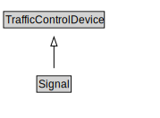

# Signal

<a href="../../diagrams/Signal.svg">Open interactive Signal diagram</a>

## Formalization

| Property | Value Restriction | Definition |
|----------|-------------------|------------|
| rdfs:subClassOf | [TrafficControlDevice](TrafficControlDevice.md) | --- |

