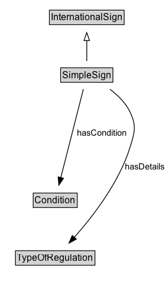

# SimpleSign

A traffic control device that consists of a single message conveyed by a single pictogram.

## Diagram

=== "SVG (interactive)"

    <!-- Generated by graphviz version 14.1.3 (20260303.0454)
     -->
    <!-- Pages: 1 -->
    <svg width="213pt" height="365pt"
     viewBox="0.00 0.00 213.00 365.00" xmlns="http://www.w3.org/2000/svg" xmlns:xlink="http://www.w3.org/1999/xlink">
    <g id="graph0" class="graph" transform="scale(1 1) rotate(0) translate(4 360.5)">
    <polygon fill="white" stroke="none" points="-4,4 -4,-360.5 208.64,-360.5 208.64,4 -4,4"/>
    <g id="clust3" class="cluster">
    <title>cluster_associated</title>
    </g>
    <!-- InternationalSign -->
    <g id="node1" class="node">
    <title>InternationalSign</title>
    <g id="a_node1"><a xlink:href="../InternationalSign" xlink:title="&lt;TABLE&gt;">
    <polygon fill="lightgray" stroke="none" points="59.62,-330.38 59.62,-346.62 152.38,-346.62 152.38,-330.38 59.62,-330.38"/>
    <text xml:space="preserve" text-anchor="start" x="60.62" y="-334.38" font-family="Arial" font-size="12.00">InternationalSign</text>
    <polygon fill="none" stroke="black" points="58.62,-329.38 58.62,-347.62 153.38,-347.62 153.38,-329.38 58.62,-329.38"/>
    </a>
    </g>
    </g>
    <!-- SimpleSign -->
    <g id="node2" class="node">
    <title>SimpleSign</title>
    <g id="a_node2"><a xlink:href="../SimpleSign" xlink:title="&lt;TABLE&gt;">
    <polygon fill="lightgray" stroke="none" points="73.88,-257.38 73.88,-273.62 138.12,-273.62 138.12,-257.38 73.88,-257.38"/>
    <text xml:space="preserve" text-anchor="start" x="74.88" y="-261.38" font-family="Arial" font-size="12.00">SimpleSign</text>
    <polygon fill="none" stroke="black" points="72.88,-256.38 72.88,-274.62 139.12,-274.62 139.12,-256.38 72.88,-256.38"/>
    </a>
    </g>
    </g>
    <!-- SimpleSign&#45;&gt;InternationalSign -->
    <g id="edge1" class="edge">
    <title>SimpleSign&#45;&gt;InternationalSign</title>
    <path fill="none" stroke="black" d="M106,-283.21C106,-290.97 106,-300.42 106,-309.24"/>
    <polygon fill="none" stroke="black" points="102.5,-309.16 106,-319.16 109.5,-309.16 102.5,-309.16"/>
    </g>
    <!-- Invis -->
    <!-- SimpleSign&#45;&gt;Invis -->
    <!-- Condition -->
    <g id="node4" class="node">
    <title>Condition</title>
    <g id="a_node4"><a xlink:href="../Condition" xlink:title="&lt;TABLE&gt;">
    <polygon fill="lightgray" stroke="none" points="39.12,-98.88 39.12,-115.12 92.88,-115.12 92.88,-98.88 39.12,-98.88"/>
    <text xml:space="preserve" text-anchor="start" x="40.12" y="-102.88" font-family="Arial" font-size="12.00">Condition</text>
    <polygon fill="none" stroke="black" points="38.12,-97.88 38.12,-116.12 93.88,-116.12 93.88,-97.88 38.12,-97.88"/>
    </a>
    </g>
    </g>
    <!-- SimpleSign&#45;&gt;Condition -->
    <g id="edge6" class="edge">
    <title>SimpleSign&#45;&gt;Condition</title>
    <path fill="none" stroke="black" d="M101.72,-247.75C94.86,-220.92 81.35,-168.04 73.05,-135.58"/>
    <polygon fill="black" stroke="black" points="76.49,-134.92 70.62,-126.09 69.71,-136.65 76.49,-134.92"/>
    <text xml:space="preserve" text-anchor="middle" x="125.62" y="-188.8" font-family="Arial" font-size="11.00">hasCondition</text>
    </g>
    <!-- TypeOfRegulation -->
    <g id="node5" class="node">
    <title>TypeOfRegulation</title>
    <g id="a_node5"><a xlink:href="../TypeOfRegulation" xlink:title="&lt;TABLE&gt;">
    <polygon fill="lightgray" stroke="none" points="16.62,-25.88 16.62,-42.12 115.38,-42.12 115.38,-25.88 16.62,-25.88"/>
    <text xml:space="preserve" text-anchor="start" x="17.62" y="-29.88" font-family="Arial" font-size="12.00">TypeOfRegulation</text>
    <polygon fill="none" stroke="black" points="15.62,-24.88 15.62,-43.12 116.38,-43.12 116.38,-24.88 15.62,-24.88"/>
    </a>
    </g>
    </g>
    <!-- SimpleSign&#45;&gt;TypeOfRegulation -->
    <g id="edge5" class="edge">
    <title>SimpleSign&#45;&gt;TypeOfRegulation</title>
    <path fill="none" stroke="black" d="M135.35,-247.51C145.41,-240.02 155.52,-230.23 161,-218.5 169.28,-200.78 166.74,-193.19 161,-174.5 147.16,-129.45 113.22,-85.95 89.89,-59.83"/>
    <polygon fill="black" stroke="black" points="92.78,-57.8 83.45,-52.78 87.61,-62.52 92.78,-57.8"/>
    <text xml:space="preserve" text-anchor="middle" x="179.51" y="-146.05" font-family="Arial" font-size="11.00">hasDetails</text>
    </g>
    <!-- Invis&#45;&gt;Condition -->
    <!-- Condition&#45;&gt;TypeOfRegulation -->
    </g>
    </svg>

=== "PNG"

    

## Formalization for SimpleSign

| Property | Constraint |
|----------|------------|
| [hasCondition](../properties/hasCondition.md) | only [Condition](https://w3id.org/itsdata/regulation/v1/Condition) |
| [hasDetails](../properties/hasDetails.md) | only [TypeOfRegulation](https://w3id.org/itsdata/regulation/v1/TypeOfRegulation) |
| subClassOf | [InternationalSign](InternationalSign.md) |

