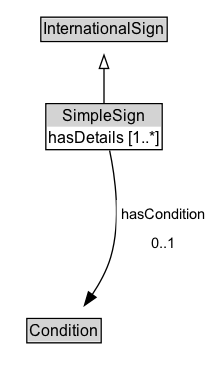

# SimpleSign

A traffic control device that consists of a single message conveyed by a single pictogram.

## Diagram

=== "SVG (interactive)"

    <!-- Generated by graphviz version 14.1.3 (20260303.0454)
     -->
    <!-- Pages: 1 -->
    <svg width="162pt" height="286pt"
     viewBox="0.00 0.00 162.00 286.00" xmlns="http://www.w3.org/2000/svg" xmlns:xlink="http://www.w3.org/1999/xlink">
    <g id="graph0" class="graph" transform="scale(1 1) rotate(0) translate(4 282)">
    <polygon fill="white" stroke="none" points="-4,4 -4,-282 158.39,-282 158.39,4 -4,4"/>
    <g id="clust3" class="cluster">
    <title>cluster_associated</title>
    </g>
    <!-- InternationalSign -->
    <g id="node1" class="node">
    <title>InternationalSign</title>
    <g id="a_node1"><a xlink:href="../InternationalSign" xlink:title="&lt;TABLE&gt;">
    <polygon fill="lightgray" stroke="none" points="27.62,-251.88 27.62,-268.12 120.38,-268.12 120.38,-251.88 27.62,-251.88"/>
    <text xml:space="preserve" text-anchor="start" x="28.62" y="-255.88" font-family="Arial" font-size="12.00">InternationalSign</text>
    <polygon fill="none" stroke="black" points="26.62,-250.88 26.62,-269.12 121.38,-269.12 121.38,-250.88 26.62,-250.88"/>
    </a>
    </g>
    </g>
    <!-- SimpleSign -->
    <g id="node2" class="node">
    <title>SimpleSign</title>
    <g id="a_node2"><a xlink:href="../SimpleSign" xlink:title="&lt;TABLE&gt;">
    <polygon fill="lightgray" stroke="none" points="31.38,-187 31.38,-203.25 116.62,-203.25 116.62,-187 31.38,-187"/>
    <text xml:space="preserve" text-anchor="start" x="42.88" y="-191" font-family="Arial" font-size="12.00">SimpleSign</text>
    <text xml:space="preserve" text-anchor="start" x="32.38" y="-174.75" font-family="Arial" font-size="12.00">hasDetails [1..&#42;]</text>
    <polygon fill="none" stroke="black" points="30.38,-169.75 30.38,-204.25 117.62,-204.25 117.62,-169.75 30.38,-169.75"/>
    </a>
    </g>
    </g>
    <!-- SimpleSign&#45;&gt;InternationalSign -->
    <g id="edge1" class="edge">
    <title>SimpleSign&#45;&gt;InternationalSign</title>
    <path fill="none" stroke="black" d="M74,-204.71C74,-212.47 74,-221.92 74,-230.74"/>
    <polygon fill="none" stroke="black" points="70.5,-230.66 74,-240.66 77.5,-230.66 70.5,-230.66"/>
    </g>
    <!-- Invis -->
    <!-- SimpleSign&#45;&gt;Invis -->
    <!-- Condition -->
    <g id="node4" class="node">
    <title>Condition</title>
    <g id="a_node4"><a xlink:href="../Condition" xlink:title="&lt;TABLE&gt;">
    <polygon fill="lightgray" stroke="none" points="17.12,-25.88 17.12,-42.12 70.88,-42.12 70.88,-25.88 17.12,-25.88"/>
    <text xml:space="preserve" text-anchor="start" x="18.12" y="-29.88" font-family="Arial" font-size="12.00">Condition</text>
    <polygon fill="none" stroke="black" points="16.12,-24.88 16.12,-43.12 71.88,-43.12 71.88,-24.88 16.12,-24.88"/>
    </a>
    </g>
    </g>
    <!-- SimpleSign&#45;&gt;Condition -->
    <g id="edge4" class="edge">
    <title>SimpleSign&#45;&gt;Condition</title>
    <path fill="none" stroke="black" d="M78.21,-169.12C82.37,-149.45 87.03,-116.17 79,-89 76.09,-79.14 70.75,-69.4 65.1,-60.96"/>
    <polygon fill="black" stroke="black" points="68.02,-59.02 59.34,-52.94 62.34,-63.11 68.02,-59.02"/>
    <polygon fill="white" stroke="none" points="83.39,-89 83.39,-132 154.39,-132 154.39,-89 83.39,-89"/>
    <text xml:space="preserve" text-anchor="start" x="87.39" y="-117.5" font-family="Arial" font-size="11.00">hasCondition</text>
    <text xml:space="preserve" text-anchor="start" x="109.89" y="-96" font-family="Arial" font-size="11.00">0..1</text>
    </g>
    <!-- Invis&#45;&gt;Condition -->
    </g>
    </svg>

=== "PNG"

    

## Formalization for SimpleSign

| Property | Constraint |
|----------|------------|
| [hasCondition](../properties/hasCondition.md) | only [Condition](https://w3id.org/itsdata/regulation/v1/Condition) |
| [hasDetails](../properties/hasDetails.md) | only [TypeOfRegulation](https://w3id.org/itsdata/regulation/v1/TypeOfRegulation) |
| subClassOf | [InternationalSign](InternationalSign.md) |

