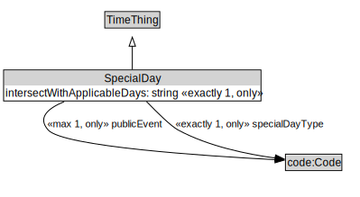

# SpecialDay

<a href="../../diagrams/SpecialDay.svg">Open interactive SpecialDay diagram</a>

## Formalization

| Property | Value Restriction | Definition |
|----------|-------------------|------------|
| intersectWithApplicableDays | exactly 1 xsd:boolean | None |
| intersectWithApplicableDays | only xsd:boolean | None |
| publicEvent | max 1 code:Code | None |
| publicEvent | only code:Code | None |
| rdfs:subClassOf | [TimeThing](TimeThing.md) | --- |
| specialDayType | exactly 1 code:Code | None |
| specialDayType | only code:Code | None |

## Other Annotations

- **xsd:pattern**: [TimePattern](TimePattern.md)

