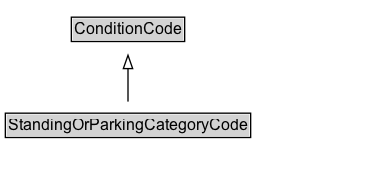

# StandingOrParkingCategoryCode

A code that indicates categories of standing or parking that can affect the applicability of a regulation.

EXAMPLE: electric vehicle charging, loading and unloading, kerbside only, verge also, etc.

## Diagram

=== "SVG (interactive)"

    <!-- Generated by graphviz version 14.1.3 (20260303.0454)
     -->
    <!-- Pages: 1 -->
    <svg width="280pt" height="132pt"
     viewBox="0.00 0.00 280.00 132.00" xmlns="http://www.w3.org/2000/svg" xmlns:xlink="http://www.w3.org/1999/xlink">
    <g id="graph0" class="graph" transform="scale(1 1) rotate(0) translate(4 128)">
    <polygon fill="white" stroke="none" points="-4,4 -4,-128 276,-128 276,4 -4,4"/>
    <g id="clust3" class="cluster">
    <title>cluster_associated</title>
    </g>
    <!-- ConditionCode -->
    <g id="node1" class="node">
    <title>ConditionCode</title>
    <g id="a_node1"><a xlink:href="../ConditionCode" xlink:title="&lt;TABLE&gt;">
    <polygon fill="lightgray" stroke="none" points="50.5,-97.88 50.5,-114.12 133.5,-114.12 133.5,-97.88 50.5,-97.88"/>
    <text xml:space="preserve" text-anchor="start" x="51.5" y="-101.88" font-family="Arial" font-size="12.00">ConditionCode</text>
    <polygon fill="none" stroke="black" points="49.5,-96.88 49.5,-115.12 134.5,-115.12 134.5,-96.88 49.5,-96.88"/>
    </a>
    </g>
    </g>
    <!-- StandingOrParkingCategoryCode -->
    <g id="node2" class="node">
    <title>StandingOrParkingCategoryCode</title>
    <g id="a_node2"><a xlink:href="../StandingOrParkingCategoryCode" xlink:title="&lt;TABLE&gt;">
    <polygon fill="lightgray" stroke="none" points="1,-25.88 1,-42.12 183,-42.12 183,-25.88 1,-25.88"/>
    <text xml:space="preserve" text-anchor="start" x="2" y="-29.88" font-family="Arial" font-size="12.00">StandingOrParkingCategoryCode</text>
    <polygon fill="none" stroke="black" points="0,-24.88 0,-43.12 184,-43.12 184,-24.88 0,-24.88"/>
    </a>
    </g>
    </g>
    <!-- StandingOrParkingCategoryCode&#45;&gt;ConditionCode -->
    <g id="edge1" class="edge">
    <title>StandingOrParkingCategoryCode&#45;&gt;ConditionCode</title>
    <path fill="none" stroke="black" d="M92,-51.79C92,-59.25 92,-68.24 92,-76.69"/>
    <polygon fill="none" stroke="black" points="88.5,-76.54 92,-86.54 95.5,-76.54 88.5,-76.54"/>
    </g>
    <!-- Invis -->
    </g>
    </svg>

=== "PNG"

    

## Formalization for StandingOrParkingCategoryCode

| Property | Constraint |
|----------|------------|
| subClassOf | [ConditionCode](ConditionCode.md) |

## Other annotations

| Property | Value |
|----------|-------|
| [rdfs:seeAlso](https://w3id.org/citydata/imported/rdfs/seeAlso) | DATEX-II StandingOrParkingConditionTypeEnum |

