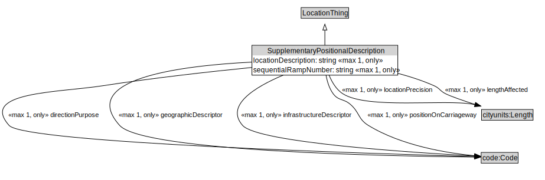

# SupplementaryPositionalDescription

<a href="../../diagrams/SupplementaryPositionalDescription.svg">Open interactive SupplementaryPositionalDescription diagram</a>

## Formalization

| Property | Value Restriction | Definition |
|----------|-------------------|------------|
| directionPurpose | max 1 code:Code | None |
| directionPurpose | only code:Code | None |
| geographicDescriptor | max 1 code:Code | None |
| geographicDescriptor | only code:Code | None |
| infrastructureDescriptor | max 1 code:Code | None |
| infrastructureDescriptor | only code:Code | None |
| lengthAffected | max 1 cityunits:Length | None |
| lengthAffected | only cityunits:Length | None |
| locationDescription | max 1 xsd:string | None |
| locationDescription | only xsd:string | None |
| locationPrecision | max 1 cityunits:Length | None |
| locationPrecision | only cityunits:Length | None |
| positionOnCarriageway | max 1 code:Code | None |
| positionOnCarriageway | only code:Code | None |
| rdfs:subClassOf | [LocationThing](LocationThing.md) | --- |
| sequentialRampNumber | max 1 xsd:integer | None |
| sequentialRampNumber | only xsd:integer | None |

## Other Annotations

- **xsd:pattern**: [LocationPattern](LocationPattern.md)

