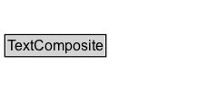

# TextComposite

An attribute that consists of text (multi-lingual string) on the default area of the main pictogram.

## Diagram

=== "SVG (interactive)"

    <!-- Generated by graphviz version 14.1.3 (20260303.0454)
     -->
    <!-- Pages: 1 -->
    <svg width="180pt" height="76pt"
     viewBox="0.00 0.00 180.00 76.00" xmlns="http://www.w3.org/2000/svg" xmlns:xlink="http://www.w3.org/1999/xlink">
    <g id="graph0" class="graph" transform="scale(1 1) rotate(0) translate(4 72)">
    <polygon fill="white" stroke="none" points="-4,4 -4,-72 175.75,-72 175.75,4 -4,4"/>
    <g id="clust3" class="cluster">
    <title>cluster_associated</title>
    </g>
    <!-- TextComposite -->
    <g id="node1" class="node">
    <title>TextComposite</title>
    <g id="a_node1"><a xlink:href="../TextComposite" xlink:title="&lt;TABLE&gt;">
    <polygon fill="lightgray" stroke="none" points="1,-25.88 1,-42.12 82.5,-42.12 82.5,-25.88 1,-25.88"/>
    <text xml:space="preserve" text-anchor="start" x="2" y="-29.88" font-family="Arial" font-size="12.00">TextComposite</text>
    <polygon fill="none" stroke="black" points="0,-24.88 0,-43.12 83.5,-43.12 83.5,-24.88 0,-24.88"/>
    </a>
    </g>
    </g>
    <!-- Invis -->
    </g>
    </svg>

=== "PNG"

    

