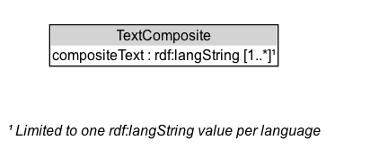

# TextComposite

An attribute that consists of text (multi-lingual string) on the default area of the main pictogram.

## Diagram

=== "SVG (interactive)"

    <!-- Generated by graphviz version 14.1.3 (20260303.0454)
     -->
    <!-- Pages: 1 -->
    <svg width="324pt" height="132pt"
     viewBox="0.00 0.00 324.00 132.00" xmlns="http://www.w3.org/2000/svg" xmlns:xlink="http://www.w3.org/1999/xlink">
    <g id="graph0" class="graph" transform="scale(1 1) rotate(0) translate(4 128)">
    <polygon fill="white" stroke="none" points="-4,4 -4,-128 319.88,-128 319.88,4 -4,4"/>
    <g id="clust3" class="cluster">
    <title>cluster_associated</title>
    </g>
    <!-- TextComposite -->
    <g id="node1" class="node">
    <title>TextComposite</title>
    <g id="a_node1"><a xlink:href="../TextComposite" xlink:title="&lt;TABLE&gt;">
    <polygon fill="lightgray" stroke="none" points="38.5,-90 38.5,-106.25 227.25,-106.25 227.25,-90 38.5,-90"/>
    <text xml:space="preserve" text-anchor="start" x="93.12" y="-94" font-family="Arial" font-size="12.00">TextComposite</text>
    <text xml:space="preserve" text-anchor="start" x="39.5" y="-77.75" font-family="Arial" font-size="12.00">compositeText : rdf:langString [1..&#42;]¹</text>
    <polygon fill="none" stroke="black" points="37.5,-72.75 37.5,-107.25 228.25,-107.25 228.25,-72.75 37.5,-72.75"/>
    </a>
    </g>
    </g>
    <!-- TextComposite_uniqueLang_note -->
    <g id="node3" class="node">
    <title>TextComposite_uniqueLang_note</title>
    <text xml:space="preserve" text-anchor="start" x="2" y="-14.72" font-family="Arial" font-style="italic" font-size="12.00">¹ Limited to one rdf:langString value per language</text>
    </g>
    <!-- TextComposite&#45;&gt;TextComposite_uniqueLang_note -->
    <!-- Invis -->
    </g>
    </svg>

=== "PNG"

    

## Formalization for TextComposite

| Property | Constraint |
|----------|------------|
| [compositeText](../properties/compositeText.md) | min 1 rdf:langString |

