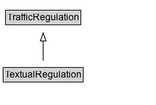

# TextualRegulation

A textual regulation is a rule having the force of law that is established by a regulator through a traffic regulation order.

## Diagram

=== "SVG (interactive)"

    <!-- Generated by graphviz version 14.1.3 (20260303.0454)
     -->
    <!-- Pages: 1 -->
    <svg width="196pt" height="132pt"
     viewBox="0.00 0.00 196.00 132.00" xmlns="http://www.w3.org/2000/svg" xmlns:xlink="http://www.w3.org/1999/xlink">
    <g id="graph0" class="graph" transform="scale(1 1) rotate(0) translate(4 128)">
    <polygon fill="white" stroke="none" points="-4,4 -4,-128 192.38,-128 192.38,4 -4,4"/>
    <g id="clust3" class="cluster">
    <title>cluster_associated</title>
    </g>
    <!-- TrafficRegulation -->
    <g id="node1" class="node">
    <title>TrafficRegulation</title>
    <g id="a_node1"><a xlink:href="../TrafficRegulation" xlink:title="&lt;TABLE&gt;">
    <polygon fill="lightgray" stroke="none" points="4,-97.88 4,-114.12 96.75,-114.12 96.75,-97.88 4,-97.88"/>
    <text xml:space="preserve" text-anchor="start" x="5" y="-101.88" font-family="Arial" font-size="12.00">TrafficRegulation</text>
    <polygon fill="none" stroke="black" points="3,-96.88 3,-115.12 97.75,-115.12 97.75,-96.88 3,-96.88"/>
    </a>
    </g>
    </g>
    <!-- TextualRegulation -->
    <g id="node2" class="node">
    <title>TextualRegulation</title>
    <g id="a_node2"><a xlink:href="../TextualRegulation" xlink:title="&lt;TABLE&gt;">
    <polygon fill="lightgray" stroke="none" points="1,-25.88 1,-42.12 99.75,-42.12 99.75,-25.88 1,-25.88"/>
    <text xml:space="preserve" text-anchor="start" x="2" y="-29.88" font-family="Arial" font-size="12.00">TextualRegulation</text>
    <polygon fill="none" stroke="black" points="0,-24.88 0,-43.12 100.75,-43.12 100.75,-24.88 0,-24.88"/>
    </a>
    </g>
    </g>
    <!-- TextualRegulation&#45;&gt;TrafficRegulation -->
    <g id="edge1" class="edge">
    <title>TextualRegulation&#45;&gt;TrafficRegulation</title>
    <path fill="none" stroke="black" d="M50.38,-51.79C50.38,-59.25 50.38,-68.24 50.38,-76.69"/>
    <polygon fill="none" stroke="black" points="46.88,-76.54 50.38,-86.54 53.88,-76.54 46.88,-76.54"/>
    </g>
    <!-- Invis -->
    </g>
    </svg>

=== "PNG"

    

## Formalization for TextualRegulation

| Property | Constraint |
|----------|------------|
| [cdm1:hasDescription](https://w3id.org/citydata/part1/v1/hasDescription) | exactly 1 |
| subClassOf | [TrafficRegulation](TrafficRegulation.md) |

## Other annotations

| Property | Value |
|----------|-------|
| [rdfs:seeAlso](https://w3id.org/citydata/imported/rdfs/seeAlso) | DATEX-II TextualRegulation |

