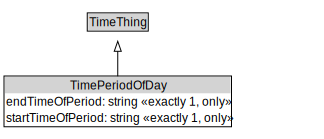

# TimePeriodOfDay

<a href="../../diagrams/TimePeriodOfDay.svg">Open interactive TimePeriodOfDay diagram</a>

## Formalization

| Property | Value Restriction | Definition |
|----------|-------------------|------------|
| endTimeOfPeriod | exactly 1 xsd:time | None |
| endTimeOfPeriod | only xsd:time | None |
| rdfs:subClassOf | [TimeThing](TimeThing.md) | --- |
| startTimeOfPeriod | exactly 1 xsd:time | None |
| startTimeOfPeriod | only xsd:time | None |

## Other Annotations

- **xsd:pattern**: [TimePattern](TimePattern.md)

