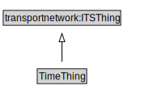

# TimeThing

<a href="../../diagrams/TimeThing.svg">Open interactive TimeThing diagram</a>

## Formalization

| Property | Value Restriction | Definition |
|----------|-------------------|------------|
| rdfs:subClassOf | transportnetwork:ITSThing | --- |

## Other Annotations

- **xsd:pattern**: [TimePattern](TimePattern.md)

