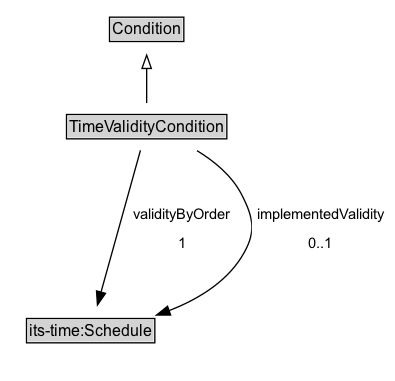

# TimeValidityCondition

A condition that applies to a specific location.

## Diagram

=== "SVG (interactive)"

    <!-- Generated by graphviz version 14.1.3 (20260303.0454)
     -->
    <!-- Pages: 1 -->
    <svg width="296pt" height="286pt"
     viewBox="0.00 0.00 296.00 286.00" xmlns="http://www.w3.org/2000/svg" xmlns:xlink="http://www.w3.org/1999/xlink">
    <g id="graph0" class="graph" transform="scale(1 1) rotate(0) translate(4 282)">
    <polygon fill="white" stroke="none" points="-4,4 -4,-282 292.14,-282 292.14,4 -4,4"/>
    <g id="clust3" class="cluster">
    <title>cluster_associated</title>
    </g>
    <!-- Condition -->
    <g id="node1" class="node">
    <title>Condition</title>
    <g id="a_node1"><a xlink:href="../Condition" xlink:title="&lt;TABLE&gt;">
    <polygon fill="lightgray" stroke="none" points="79.12,-251.88 79.12,-268.12 132.88,-268.12 132.88,-251.88 79.12,-251.88"/>
    <text xml:space="preserve" text-anchor="start" x="80.12" y="-255.88" font-family="Arial" font-size="12.00">Condition</text>
    <polygon fill="none" stroke="black" points="78.12,-250.88 78.12,-269.12 133.88,-269.12 133.88,-250.88 78.12,-250.88"/>
    </a>
    </g>
    </g>
    <!-- TimeValidityCondition -->
    <g id="node2" class="node">
    <title>TimeValidityCondition</title>
    <g id="a_node2"><a xlink:href="../TimeValidityCondition" xlink:title="&lt;TABLE&gt;">
    <polygon fill="lightgray" stroke="none" points="46.88,-178.88 46.88,-195.12 165.12,-195.12 165.12,-178.88 46.88,-178.88"/>
    <text xml:space="preserve" text-anchor="start" x="47.88" y="-182.88" font-family="Arial" font-size="12.00">TimeValidityCondition</text>
    <polygon fill="none" stroke="black" points="45.88,-177.88 45.88,-196.12 166.12,-196.12 166.12,-177.88 45.88,-177.88"/>
    </a>
    </g>
    </g>
    <!-- TimeValidityCondition&#45;&gt;Condition -->
    <g id="edge1" class="edge">
    <title>TimeValidityCondition&#45;&gt;Condition</title>
    <path fill="none" stroke="black" d="M106,-204.71C106,-212.47 106,-221.92 106,-230.74"/>
    <polygon fill="none" stroke="black" points="102.5,-230.66 106,-240.66 109.5,-230.66 102.5,-230.66"/>
    </g>
    <!-- Invis -->
    <!-- TimeValidityCondition&#45;&gt;Invis -->
    <!-- its&#45;time_Schedule -->
    <g id="node4" class="node">
    <title>its&#45;time_Schedule</title>
    <g id="a_node4"><a xlink:href="https://w3id.org/itsdata/time/v1/Schedule" xlink:title="&lt;TABLE&gt;">
    <polygon fill="lightgray" stroke="none" points="16.88,-25.88 16.88,-42.12 111.12,-42.12 111.12,-25.88 16.88,-25.88"/>
    <text xml:space="preserve" text-anchor="start" x="17.88" y="-29.88" font-family="Arial" font-size="12.00">its&#45;time:Schedule</text>
    <polygon fill="none" stroke="black" points="15.88,-24.88 15.88,-43.12 112.12,-43.12 112.12,-24.88 15.88,-24.88"/>
    </a>
    </g>
    </g>
    <!-- TimeValidityCondition&#45;&gt;its&#45;time_Schedule -->
    <g id="edge4" class="edge">
    <title>TimeValidityCondition&#45;&gt;its&#45;time_Schedule</title>
    <path fill="none" stroke="black" d="M101.34,-169.26C94.19,-143.53 80.4,-93.95 71.72,-62.77"/>
    <polygon fill="black" stroke="black" points="75.13,-61.97 69.08,-53.27 68.39,-63.84 75.13,-61.97"/>
    <polygon fill="white" stroke="none" points="92.22,-89 92.22,-132 172.97,-132 172.97,-89 92.22,-89"/>
    <text xml:space="preserve" text-anchor="start" x="96.22" y="-117.5" font-family="Arial" font-size="11.00">validityByOrder</text>
    <text xml:space="preserve" text-anchor="start" x="129.59" y="-96" font-family="Arial" font-size="11.00">1</text>
    </g>
    <!-- TimeValidityCondition&#45;&gt;its&#45;time_Schedule -->
    <g id="edge5" class="edge">
    <title>TimeValidityCondition&#45;&gt;its&#45;time_Schedule</title>
    <path fill="none" stroke="black" d="M143.72,-169.02C156.7,-161.12 169.77,-150.35 177,-136.5 186.77,-117.78 188.26,-106.86 177,-89 164.81,-69.66 143.56,-57.09 122.76,-49"/>
    <polygon fill="black" stroke="black" points="123.99,-45.73 113.4,-45.67 121.65,-52.32 123.99,-45.73"/>
    <polygon fill="white" stroke="none" points="184.89,-89 184.89,-132 288.14,-132 288.14,-89 184.89,-89"/>
    <text xml:space="preserve" text-anchor="start" x="188.89" y="-117.5" font-family="Arial" font-size="11.00">implementedValidity</text>
    <text xml:space="preserve" text-anchor="start" x="227.52" y="-96" font-family="Arial" font-size="11.00">0..1</text>
    </g>
    <!-- Invis&#45;&gt;its&#45;time_Schedule -->
    </g>
    </svg>

=== "PNG"

    

## Formalization for TimeValidityCondition

| Property | Constraint |
|----------|------------|
| [implementedValidity](../properties/implementedValidity.md) | only [its-time:Schedule](https://w3id.org/itsdata/time/v1/Schedule) |
| [validityByOrder](../properties/validityByOrder.md) | exactly 1 |
| [validityByOrder](../properties/validityByOrder.md) | only [its-time:Schedule](https://w3id.org/itsdata/time/v1/Schedule) |
| subClassOf | [Condition](Condition.md) |

## Other annotations

| Property | Value |
|----------|-------|
| [rdfs:seeAlso](https://w3id.org/citydata/imported/rdfs/seeAlso) | DATEX-II LocationCondition |

