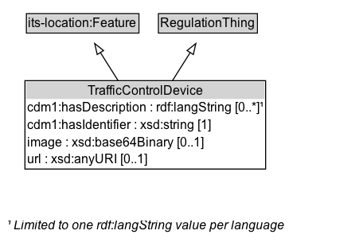

# TrafficControlDevice

A device that is used to control traffic, such as a road sign, traffic signal, or pavement marking.

## Diagram

=== "SVG (interactive)"

    <!-- Generated by graphviz version 14.1.3 (20260303.0454)
     -->
    <!-- Pages: 1 -->
    <svg width="342pt" height="235pt"
     viewBox="0.00 0.00 342.00 235.00" xmlns="http://www.w3.org/2000/svg" xmlns:xlink="http://www.w3.org/1999/xlink">
    <g id="graph0" class="graph" transform="scale(1 1) rotate(0) translate(4 231.25)">
    <polygon fill="white" stroke="none" points="-4,4 -4,-231.25 337.88,-231.25 337.88,4 -4,4"/>
    <g id="clust3" class="cluster">
    <title>cluster_associated</title>
    </g>
    <!-- its&#45;location_Feature -->
    <g id="node1" class="node">
    <title>its&#45;location_Feature</title>
    <g id="a_node1"><a xlink:href="https://w3id.org/itsdata/location/v1/Feature" xlink:title="&lt;TABLE&gt;">
    <polygon fill="lightgray" stroke="none" points="21.88,-201.12 21.88,-217.38 125.88,-217.38 125.88,-201.12 21.88,-201.12"/>
    <text xml:space="preserve" text-anchor="start" x="22.88" y="-205.12" font-family="Arial" font-size="12.00">its&#45;location:Feature</text>
    <polygon fill="none" stroke="black" points="20.88,-200.12 20.88,-218.38 126.88,-218.38 126.88,-200.12 20.88,-200.12"/>
    </a>
    </g>
    </g>
    <!-- RegulationThing -->
    <g id="node2" class="node">
    <title>RegulationThing</title>
    <g id="a_node2"><a xlink:href="../RegulationThing" xlink:title="&lt;TABLE&gt;">
    <polygon fill="lightgray" stroke="none" points="146.25,-201.12 146.25,-217.38 237.5,-217.38 237.5,-201.12 146.25,-201.12"/>
    <text xml:space="preserve" text-anchor="start" x="147.25" y="-205.12" font-family="Arial" font-size="12.00">RegulationThing</text>
    <polygon fill="none" stroke="black" points="145.25,-200.12 145.25,-218.38 238.5,-218.38 238.5,-200.12 145.25,-200.12"/>
    </a>
    </g>
    </g>
    <!-- TrafficControlDevice -->
    <g id="node3" class="node">
    <title>TrafficControlDevice</title>
    <g id="a_node3"><a xlink:href="../TrafficControlDevice" xlink:title="&lt;TABLE&gt;">
    <polygon fill="lightgray" stroke="none" points="20.5,-138 20.5,-154.25 245.25,-154.25 245.25,-138 20.5,-138"/>
    <text xml:space="preserve" text-anchor="start" x="78.5" y="-142" font-family="Arial" font-size="12.00">TrafficControlDevice</text>
    <text xml:space="preserve" text-anchor="start" x="21.5" y="-125.75" font-family="Arial" font-size="12.00">cdm1:hasDescription : rdf:langString [0..&#42;]¹</text>
    <text xml:space="preserve" text-anchor="start" x="21.5" y="-109.5" font-family="Arial" font-size="12.00">cdm1:hasIdentifier : xsd:string [1]</text>
    <text xml:space="preserve" text-anchor="start" x="21.5" y="-93.25" font-family="Arial" font-size="12.00">image : xsd:base64Binary [0..1]</text>
    <text xml:space="preserve" text-anchor="start" x="21.5" y="-77" font-family="Arial" font-size="12.00">url : xsd:anyURI [0..1]</text>
    <polygon fill="none" stroke="black" points="19.5,-72 19.5,-155.25 246.25,-155.25 246.25,-72 19.5,-72"/>
    </a>
    </g>
    </g>
    <!-- TrafficControlDevice&#45;&gt;its&#45;location_Feature -->
    <g id="edge1" class="edge">
    <title>TrafficControlDevice&#45;&gt;its&#45;location_Feature</title>
    <path fill="none" stroke="black" d="M107.46,-154.95C101.71,-164.08 95.74,-173.55 90.46,-181.93"/>
    <polygon fill="none" stroke="black" points="87.6,-179.9 85.23,-190.23 93.52,-183.64 87.6,-179.9"/>
    </g>
    <!-- TrafficControlDevice&#45;&gt;RegulationThing -->
    <g id="edge2" class="edge">
    <title>TrafficControlDevice&#45;&gt;RegulationThing</title>
    <path fill="none" stroke="black" d="M158.29,-154.95C164.04,-164.08 170.01,-173.55 175.29,-181.93"/>
    <polygon fill="none" stroke="black" points="172.23,-183.64 180.52,-190.23 178.15,-179.9 172.23,-183.64"/>
    </g>
    <!-- TrafficControlDevice_uniqueLang_note -->
    <g id="node5" class="node">
    <title>TrafficControlDevice_uniqueLang_note</title>
    <text xml:space="preserve" text-anchor="start" x="2" y="-14.72" font-family="Arial" font-style="italic" font-size="12.00">¹ Limited to one rdf:langString value per language</text>
    </g>
    <!-- TrafficControlDevice&#45;&gt;TrafficControlDevice_uniqueLang_note -->
    <!-- Invis -->
    </g>
    </svg>

=== "PNG"

    

## Specializations of TrafficControlDevice

| Class | Description |
|-------|-------------|
| [Access Control Device](AccessControlDevice.md) | A device that is used to control access to a specific area, such as a gate or barrier. |
| [Channelization Device](ChannelizationDevice.md) | A device that is used to guide or direct traffic, such as a curb or a series of cones, barrels, or barricades. |
| [Composite Sign](CompositeSign.md) | A single traffic-control unit whose content is an ordered sequence of one or more SimpleSigns, represented as an rdf:List: rdf:first is the main sign, and each rdf:rest step is the next panel in order (for example supplemental signs). |
| [International Sign](InternationalSign.md) | A traffic control device that is used to convey information to road users, such as regulatory, warning, or guide signs. |
| [Pavement Marking](PavementMarking.md) | A device that is used to mark the pavement, such as lines, symbols, or text. |
| [Road Surface Feature](RoadSurfaceFeature.md) | A traffic control device that changes the nature of the road surface, such as rumble strips or speed bumps. |
| [Simple Sign](SimpleSign.md) | A traffic control device that consists of a single message conveyed by a single pictogram. |
| [Traffic Signal](TrafficSignal.md) | A traffic control device that is used to control traffic flow at intersections or pedestrian crossings using lights. |
| [Traffic Signal Device](TrafficSignalDevice.md) | A device that is used to control traffic signals, including traffic lights and warning beacons. |
| [Warning Beacon](WarningBeacon.md) | A device that is used to warn road users of potential hazards or to draw attention to specific conditions using lights or signals. |

## Formalization for TrafficControlDevice

| Property | Constraint |
|----------|------------|
| [cdm1:hasDescription](https://w3id.org/citydata/part1/v1/hasDescription) | 0..* rdf:langString (one per language) |
| [cdm1:hasIdentifier](https://w3id.org/citydata/part1/v1/hasIdentifier) | exactly 1 xsd:string |
| [image](../properties/image.md) | max 1 xsd:base64Binary |
| [url](../properties/url.md) | max 1 xsd:anyURI |
| subClassOf | [RegulationThing](RegulationThing.md) |
| subClassOf | [its-location:Feature](https://w3id.org/itsdata/location/v1/Feature) |

## Other annotations

| Property | Value |
|----------|-------|
| [dash:abstract](https://w3id.org/citydata/imported/dash/abstract) | true |

