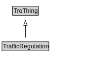

# TrafficRegulation

A traffic regulation is a rule having the force of law that is established by a regulator through a traffic regulation order.

<a href="../../diagrams/TrafficRegulation.svg">Open interactive TrafficRegulation diagram</a>

## Formalization for TrafficRegulation

| Property | Value Restriction | Definition |
|----------|-------------------|------------|
| associatedTrafficControlDevice | only [TrafficControlDevice](TrafficControlDevice.md) | None |
| rdfs:subClassOf | [TroThing](TroThing.md) | --- |

## TrafficRegulation Is Used By

- [TrafficRegulationOrder](TrafficRegulationOrder.md).trafficRegulation

## Other Annotations

- **xsd::pattern**: TroPattern

