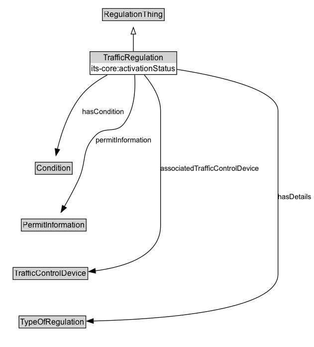

# TrafficRegulation

A traffic regulation is a rule having the force of law that is established by a regulator through a traffic regulation order.

## Diagram

=== "SVG (interactive)"

    <!-- Generated by graphviz version 14.1.3 (20260303.0454)
     -->
    <!-- Pages: 1 -->
    <svg width="473pt" height="523pt"
     viewBox="0.00 0.00 473.00 523.00" xmlns="http://www.w3.org/2000/svg" xmlns:xlink="http://www.w3.org/1999/xlink">
    <g id="graph0" class="graph" transform="scale(1 1) rotate(0) translate(4 519)">
    <polygon fill="white" stroke="none" points="-4,4 -4,-519 469.25,-519 469.25,4 -4,4"/>
    <g id="clust3" class="cluster">
    <title>cluster_associated</title>
    </g>
    <!-- RegulationThing -->
    <g id="node1" class="node">
    <title>RegulationThing</title>
    <g id="a_node1"><a xlink:href="../RegulationThing" xlink:title="&lt;TABLE&gt;">
    <polygon fill="lightgray" stroke="none" points="151.38,-488.88 151.38,-505.12 242.62,-505.12 242.62,-488.88 151.38,-488.88"/>
    <text xml:space="preserve" text-anchor="start" x="152.38" y="-492.88" font-family="Arial" font-size="12.00">RegulationThing</text>
    <polygon fill="none" stroke="black" points="150.38,-487.88 150.38,-506.12 243.62,-506.12 243.62,-487.88 150.38,-487.88"/>
    </a>
    </g>
    </g>
    <!-- TrafficRegulation -->
    <g id="node2" class="node">
    <title>TrafficRegulation</title>
    <g id="a_node2"><a xlink:href="../TrafficRegulation" xlink:title="&lt;TABLE&gt;">
    <polygon fill="lightgray" stroke="none" points="132.62,-424 132.62,-440.25 261.38,-440.25 261.38,-424 132.62,-424"/>
    <text xml:space="preserve" text-anchor="start" x="151.62" y="-428" font-family="Arial" font-size="12.00">TrafficRegulation</text>
    <text xml:space="preserve" text-anchor="start" x="133.62" y="-411.75" font-family="Arial" font-size="12.00">its&#45;core:activationStatus</text>
    <polygon fill="none" stroke="black" points="131.62,-406.75 131.62,-441.25 262.38,-441.25 262.38,-406.75 131.62,-406.75"/>
    </a>
    </g>
    </g>
    <!-- TrafficRegulation&#45;&gt;RegulationThing -->
    <g id="edge1" class="edge">
    <title>TrafficRegulation&#45;&gt;RegulationThing</title>
    <path fill="none" stroke="black" d="M197,-441.71C197,-449.47 197,-458.92 197,-467.74"/>
    <polygon fill="none" stroke="black" points="193.5,-467.66 197,-477.66 200.5,-467.66 193.5,-467.66"/>
    </g>
    <!-- Invis -->
    <!-- TrafficRegulation&#45;&gt;Invis -->
    <!-- Condition -->
    <g id="node4" class="node">
    <title>Condition</title>
    <g id="a_node4"><a xlink:href="../Condition" xlink:title="&lt;TABLE&gt;">
    <polygon fill="lightgray" stroke="none" points="50.12,-257.38 50.12,-273.62 103.88,-273.62 103.88,-257.38 50.12,-257.38"/>
    <text xml:space="preserve" text-anchor="start" x="51.12" y="-261.38" font-family="Arial" font-size="12.00">Condition</text>
    <polygon fill="none" stroke="black" points="49.12,-256.38 49.12,-274.62 104.88,-274.62 104.88,-256.38 49.12,-256.38"/>
    </a>
    </g>
    </g>
    <!-- TrafficRegulation&#45;&gt;Condition -->
    <g id="edge9" class="edge">
    <title>TrafficRegulation&#45;&gt;Condition</title>
    <path fill="none" stroke="black" d="M157.66,-406.04C144.28,-398.71 130.15,-389.01 120,-377 99.77,-353.06 88.39,-318.5 82.49,-294.43"/>
    <polygon fill="black" stroke="black" points="85.91,-293.69 80.29,-284.71 79.08,-295.23 85.91,-293.69"/>
    <text xml:space="preserve" text-anchor="middle" x="151.5" y="-347.3" font-family="Arial" font-size="11.00">hasCondition</text>
    </g>
    <!-- PermitInformation -->
    <g id="node5" class="node">
    <title>PermitInformation</title>
    <g id="a_node5"><a xlink:href="../PermitInformation" xlink:title="&lt;TABLE&gt;">
    <polygon fill="lightgray" stroke="none" points="29.12,-171.88 29.12,-188.12 124.88,-188.12 124.88,-171.88 29.12,-171.88"/>
    <text xml:space="preserve" text-anchor="start" x="30.12" y="-175.88" font-family="Arial" font-size="12.00">PermitInformation</text>
    <polygon fill="none" stroke="black" points="28.12,-170.88 28.12,-189.12 125.88,-189.12 125.88,-170.88 28.12,-170.88"/>
    </a>
    </g>
    </g>
    <!-- TrafficRegulation&#45;&gt;PermitInformation -->
    <g id="edge10" class="edge">
    <title>TrafficRegulation&#45;&gt;PermitInformation</title>
    <path fill="none" stroke="black" d="M198.96,-406.17C200.3,-386.52 199.48,-354.04 183,-333 170.23,-316.69 154.44,-329.86 140,-315 117.6,-291.94 127.63,-276.62 114,-247.5 107.72,-234.08 99.84,-219.66 92.97,-207.68"/>
    <polygon fill="black" stroke="black" points="96.08,-206.06 88.02,-199.19 90.03,-209.59 96.08,-206.06"/>
    <text xml:space="preserve" text-anchor="middle" x="182" y="-304.55" font-family="Arial" font-size="11.00">permitInformation</text>
    </g>
    <!-- TrafficControlDevice -->
    <g id="node6" class="node">
    <title>TrafficControlDevice</title>
    <g id="a_node6"><a xlink:href="../TrafficControlDevice" xlink:title="&lt;TABLE&gt;">
    <polygon fill="lightgray" stroke="none" points="16.62,-98.88 16.62,-115.12 127.38,-115.12 127.38,-98.88 16.62,-98.88"/>
    <text xml:space="preserve" text-anchor="start" x="17.62" y="-102.88" font-family="Arial" font-size="12.00">TrafficControlDevice</text>
    <polygon fill="none" stroke="black" points="15.62,-97.88 15.62,-116.12 128.38,-116.12 128.38,-97.88 15.62,-97.88"/>
    </a>
    </g>
    </g>
    <!-- TrafficRegulation&#45;&gt;TrafficControlDevice -->
    <g id="edge8" class="edge">
    <title>TrafficRegulation&#45;&gt;TrafficControlDevice</title>
    <path fill="none" stroke="black" d="M213.44,-406.17C224.85,-392.68 238,-372.64 238,-352 238,-352 238,-352 238,-179 238,-133.83 185.39,-117.01 139.41,-110.95"/>
    <polygon fill="black" stroke="black" points="140.04,-107.5 129.7,-109.83 139.24,-114.45 140.04,-107.5"/>
    <text xml:space="preserve" text-anchor="middle" x="312.25" y="-261.8" font-family="Arial" font-size="11.00">associatedTrafficControlDevice</text>
    </g>
    <!-- TypeOfRegulation -->
    <g id="node7" class="node">
    <title>TypeOfRegulation</title>
    <g id="a_node7"><a xlink:href="../TypeOfRegulation" xlink:title="&lt;TABLE&gt;">
    <polygon fill="lightgray" stroke="none" points="25.62,-25.88 25.62,-42.12 124.38,-42.12 124.38,-25.88 25.62,-25.88"/>
    <text xml:space="preserve" text-anchor="start" x="26.62" y="-29.88" font-family="Arial" font-size="12.00">TypeOfRegulation</text>
    <polygon fill="none" stroke="black" points="24.62,-24.88 24.62,-43.12 125.38,-43.12 125.38,-24.88 24.62,-24.88"/>
    </a>
    </g>
    </g>
    <!-- TrafficRegulation&#45;&gt;TypeOfRegulation -->
    <g id="edge7" class="edge">
    <title>TrafficRegulation&#45;&gt;TypeOfRegulation</title>
    <path fill="none" stroke="black" d="M262.11,-414.59C326.35,-404.42 415,-384.49 415,-352 415,-352 415,-352 415,-106 415,-49.74 234.33,-37.77 136.4,-35.42"/>
    <polygon fill="black" stroke="black" points="136.75,-31.93 126.68,-35.22 136.61,-38.93 136.75,-31.93"/>
    <text xml:space="preserve" text-anchor="middle" x="440.12" y="-219.05" font-family="Arial" font-size="11.00">hasDetails</text>
    </g>
    <!-- Invis&#45;&gt;Condition -->
    <!-- Condition&#45;&gt;PermitInformation -->
    <!-- PermitInformation&#45;&gt;TrafficControlDevice -->
    <!-- TrafficControlDevice&#45;&gt;TypeOfRegulation -->
    </g>
    </svg>

=== "PNG"

    

## Formalization for TrafficRegulation

| Property | Constraint |
|----------|------------|
| [associatedTrafficControlDevice](../properties/associatedTrafficControlDevice.md) | only [TrafficControlDevice](https://w3id.org/itsdata/regulation/v1/TrafficControlDevice) |
| [hasCondition](../properties/hasCondition.md) | only [Condition](https://w3id.org/itsdata/regulation/v1/Condition) |
| [hasDetails](../properties/hasDetails.md) | only [TypeOfRegulation](https://w3id.org/itsdata/regulation/v1/TypeOfRegulation) |
| [its-core:activationStatus](https://w3id.org/itsdata/core/v1/activationStatus) | only [its-core:ActivationStatusCode](https://w3id.org/itsdata/core/v1/ActivationStatusCode) |
| [permitInformation](../properties/permitInformation.md) | only [PermitInformation](https://w3id.org/itsdata/regulation/v1/PermitInformation) |
| subClassOf | [RegulationThing](RegulationThing.md) |

