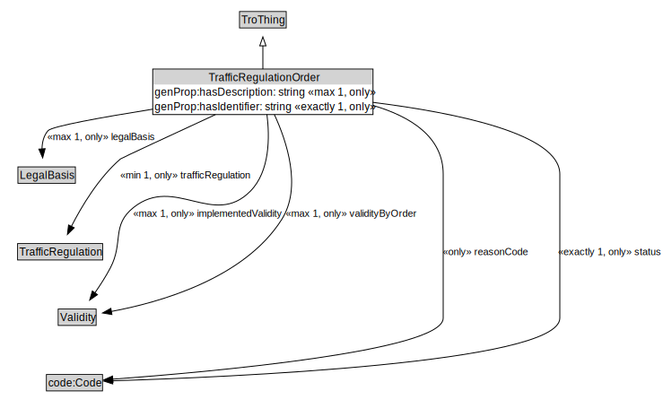

# TrafficRegulationOrder

A TrafficRegulation Order is a legally recognised document that specifies one or more traffic regulations.

<a href="../../diagrams/TrafficRegulationOrder.svg">Open interactive TrafficRegulationOrder diagram</a>

## Formalization

| Property | Value Restriction | Definition |
|----------|-------------------|------------|
| genProp:hasDescription | max 1 xsd:string | None |
| genProp:hasDescription | only xsd:string | None |
| genProp:hasIdentifier | exactly 1 xsd:string | None |
| genProp:hasIdentifier | only xsd:string | None |
| implementedValidity | max 1 [Validity](Validity.md) | None |
| implementedValidity | only [Validity](Validity.md) | None |
| legalBasis | max 1 [LegalBasis](LegalBasis.md) | formal authority within the law (e.g., statute, ordinance, administrative rule, constitutional provision) that empowers an entity to create, adopt, or enforce a regulation |
| legalBasis | only [LegalBasis](LegalBasis.md) | formal authority within the law (e.g., statute, ordinance, administrative rule, constitutional provision) that empowers an entity to create, adopt, or enforce a regulation |
| rdfs:subClassOf | [TroThing](TroThing.md) | --- |
| reasonCode | only code:Code | A reason justifying the existence of the instance of the class |
| status | exactly 1 code:Code | The status of the instance of the containing class |
| status | only code:Code | The status of the instance of the containing class |
| trafficRegulation | min 1 [TrafficRegulation](TrafficRegulation.md) | None |
| trafficRegulation | only [TrafficRegulation](TrafficRegulation.md) | None |
| validityByOrder | max 1 [Validity](Validity.md) | None |
| validityByOrder | only [Validity](Validity.md) | None |

## Other Annotations

- **xsd:pattern**: [TroPattern](TroPattern.md)

