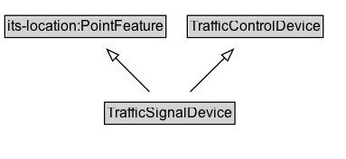

# TrafficSignalDevice

A device that is used to control traffic signals, including traffic lights and warning beacons.

## Diagram

=== "SVG (interactive)"

    <!-- Generated by graphviz version 14.1.3 (20260303.0454)
     -->
    <!-- Pages: 1 -->
    <svg width="287pt" height="132pt"
     viewBox="0.00 0.00 287.00 132.00" xmlns="http://www.w3.org/2000/svg" xmlns:xlink="http://www.w3.org/1999/xlink">
    <g id="graph0" class="graph" transform="scale(1 1) rotate(0) translate(4 128)">
    <polygon fill="white" stroke="none" points="-4,4 -4,-128 282.88,-128 282.88,4 -4,4"/>
    <g id="clust3" class="cluster">
    <title>cluster_associated</title>
    </g>
    <!-- its&#45;location_PointFeature -->
    <g id="node1" class="node">
    <title>its&#45;location_PointFeature</title>
    <g id="a_node1"><a xlink:href="https://w3id.org/itsdata/location/v1/PointFeature" xlink:title="&lt;TABLE&gt;">
    <polygon fill="lightgray" stroke="none" points="1,-97.88 1,-114.12 132.75,-114.12 132.75,-97.88 1,-97.88"/>
    <text xml:space="preserve" text-anchor="start" x="2" y="-101.88" font-family="Arial" font-size="12.00">its&#45;location:PointFeature</text>
    <polygon fill="none" stroke="black" points="0,-96.88 0,-115.12 133.75,-115.12 133.75,-96.88 0,-96.88"/>
    </a>
    </g>
    </g>
    <!-- TrafficControlDevice -->
    <g id="node2" class="node">
    <title>TrafficControlDevice</title>
    <g id="a_node2"><a xlink:href="../TrafficControlDevice" xlink:title="&lt;TABLE&gt;">
    <polygon fill="lightgray" stroke="none" points="152.5,-97.88 152.5,-114.12 263.25,-114.12 263.25,-97.88 152.5,-97.88"/>
    <text xml:space="preserve" text-anchor="start" x="153.5" y="-101.88" font-family="Arial" font-size="12.00">TrafficControlDevice</text>
    <polygon fill="none" stroke="black" points="151.5,-96.88 151.5,-115.12 264.25,-115.12 264.25,-96.88 151.5,-96.88"/>
    </a>
    </g>
    </g>
    <!-- TrafficSignalDevice -->
    <g id="node3" class="node">
    <title>TrafficSignalDevice</title>
    <g id="a_node3"><a xlink:href="../TrafficSignalDevice" xlink:title="&lt;TABLE&gt;">
    <polygon fill="lightgray" stroke="none" points="83.75,-25.88 83.75,-42.12 190,-42.12 190,-25.88 83.75,-25.88"/>
    <text xml:space="preserve" text-anchor="start" x="84.75" y="-29.88" font-family="Arial" font-size="12.00">TrafficSignalDevice</text>
    <polygon fill="none" stroke="black" points="82.75,-24.88 82.75,-43.12 191,-43.12 191,-24.88 82.75,-24.88"/>
    </a>
    </g>
    </g>
    <!-- TrafficSignalDevice&#45;&gt;its&#45;location_PointFeature -->
    <g id="edge1" class="edge">
    <title>TrafficSignalDevice&#45;&gt;its&#45;location_PointFeature</title>
    <path fill="none" stroke="black" d="M120.09,-51.79C111.6,-60.28 101.13,-70.75 91.73,-80.15"/>
    <polygon fill="none" stroke="black" points="89.49,-77.44 84.89,-86.98 94.44,-82.39 89.49,-77.44"/>
    </g>
    <!-- TrafficSignalDevice&#45;&gt;TrafficControlDevice -->
    <g id="edge2" class="edge">
    <title>TrafficSignalDevice&#45;&gt;TrafficControlDevice</title>
    <path fill="none" stroke="black" d="M153.9,-51.79C162.51,-60.28 173.13,-70.75 182.67,-80.15"/>
    <polygon fill="none" stroke="black" points="180.03,-82.46 189.61,-86.99 184.95,-77.48 180.03,-82.46"/>
    </g>
    <!-- Invis -->
    </g>
    </svg>

=== "PNG"

    

## Specializations of TrafficSignalDevice

| Class | Description |
|-------|-------------|
| [Traffic Signal](TrafficSignal.md) | A traffic control device that is used to control traffic flow at intersections or pedestrian crossings using lights. |
| [Warning Beacon](WarningBeacon.md) | A device that is used to warn road users of potential hazards or to draw attention to specific conditions using lights or signals. |

## Formalization for TrafficSignalDevice

| Property | Constraint |
|----------|------------|
| subClassOf | [TrafficControlDevice](TrafficControlDevice.md) |
| subClassOf | [its-location:PointFeature](https://w3id.org/itsdata/location/v1/PointFeature) |

## Other annotations

| Property | Value |
|----------|-------|
| [dash:abstract](https://w3id.org/citydata/imported/dash/abstract) | true |

