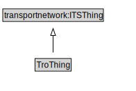

# TroThing

<a href="../../diagrams/TroThing.svg">Open interactive TroThing diagram</a>

## Formalization

| Property | Value Restriction | Definition |
|----------|-------------------|------------|
| rdfs:subClassOf | transportnetwork:ITSThing | --- |

## Other Annotations

- **xsd:pattern**: [TroPattern](TroPattern.md)

