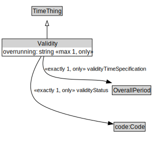

# Validity

<a href="../../diagrams/Validity.svg">Open interactive Validity diagram</a>

## Formalization

| Property | Value Restriction | Definition |
|----------|-------------------|------------|
| overrunning | max 1 xsd:boolean | None |
| overrunning | only xsd:boolean | None |
| rdfs:subClassOf | [TimeThing](TimeThing.md) | --- |
| validityStatus | exactly 1 code:Code | None |
| validityStatus | only code:Code | None |
| validityTimeSpecification | exactly 1 [OverallPeriod](OverallPeriod.md) | None |
| validityTimeSpecification | only [OverallPeriod](OverallPeriod.md) | None |

## Other Annotations

- **xsd:pattern**: [TimePattern](TimePattern.md)

