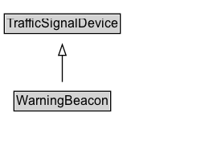

# WarningBeacon

A device that is used to warn road users of potential hazards or to draw attention to specific conditions using lights or signals.

## Diagram

=== "SVG (interactive)"

    <!-- Generated by graphviz version 14.1.3 (20260303.0454)
     -->
    <!-- Pages: 1 -->
    <svg width="195pt" height="132pt"
     viewBox="0.00 0.00 195.00 132.00" xmlns="http://www.w3.org/2000/svg" xmlns:xlink="http://www.w3.org/1999/xlink">
    <g id="graph0" class="graph" transform="scale(1 1) rotate(0) translate(4 128)">
    <polygon fill="white" stroke="none" points="-4,4 -4,-128 191.12,-128 191.12,4 -4,4"/>
    <g id="clust3" class="cluster">
    <title>cluster_associated</title>
    </g>
    <!-- TrafficSignalDevice -->
    <g id="node1" class="node">
    <title>TrafficSignalDevice</title>
    <g id="a_node1"><a xlink:href="../TrafficSignalDevice" xlink:title="&lt;TABLE&gt;">
    <polygon fill="lightgray" stroke="none" points="1,-97.88 1,-114.12 107.25,-114.12 107.25,-97.88 1,-97.88"/>
    <text xml:space="preserve" text-anchor="start" x="2" y="-101.88" font-family="Arial" font-size="12.00">TrafficSignalDevice</text>
    <polygon fill="none" stroke="black" points="0,-96.88 0,-115.12 108.25,-115.12 108.25,-96.88 0,-96.88"/>
    </a>
    </g>
    </g>
    <!-- WarningBeacon -->
    <g id="node2" class="node">
    <title>WarningBeacon</title>
    <g id="a_node2"><a xlink:href="../WarningBeacon" xlink:title="&lt;TABLE&gt;">
    <polygon fill="lightgray" stroke="none" points="10,-25.88 10,-42.12 98.25,-42.12 98.25,-25.88 10,-25.88"/>
    <text xml:space="preserve" text-anchor="start" x="11" y="-29.88" font-family="Arial" font-size="12.00">WarningBeacon</text>
    <polygon fill="none" stroke="black" points="9,-24.88 9,-43.12 99.25,-43.12 99.25,-24.88 9,-24.88"/>
    </a>
    </g>
    </g>
    <!-- WarningBeacon&#45;&gt;TrafficSignalDevice -->
    <g id="edge1" class="edge">
    <title>WarningBeacon&#45;&gt;TrafficSignalDevice</title>
    <path fill="none" stroke="black" d="M54.12,-51.79C54.12,-59.25 54.12,-68.24 54.12,-76.69"/>
    <polygon fill="none" stroke="black" points="50.63,-76.54 54.13,-86.54 57.63,-76.54 50.63,-76.54"/>
    </g>
    <!-- Invis -->
    </g>
    </svg>

=== "PNG"

    

## Formalization for WarningBeacon

| Property | Constraint |
|----------|------------|
| subClassOf | [TrafficSignalDevice](TrafficSignalDevice.md) |

