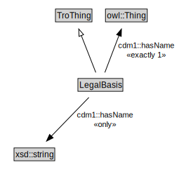

# LegalBasis

A legal basis provides references to the legal documents that authorize an entity to issue the types of regulations covered by a traffic regulation order.

<a href="../../diagrams/itsRegulation__LegalBasis.dot.svg">Open interactive LegalBasis diagram</a>

## Formalization for LegalBasis

| Property | Constraint |
|----------|------------|
| cdm1::hasName | all xsd::string |
| cdm1::hasName | exactly 1 owl::Thing |
| date | all xsd::date |
| date | max 1 owl::Thing |
| subClassOf | TroThing |
| version | all xsd::string |
| version | max 1 owl::Thing |

## Used by classes

| Class | Property |
|-------|----------|
| [Traffic Regulation Order](itsRegulation__TrafficRegulationOrder.md) | legalBasis |

## Other annotations

| Annotation | Value |
|------------|-------|
| xsd::pattern | TroPattern |

