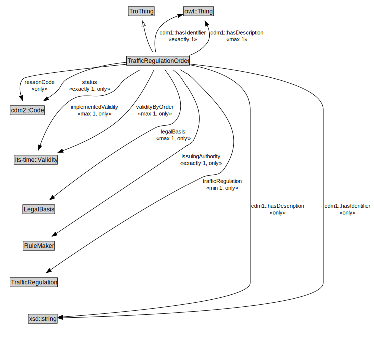

# TrafficRegulationOrder

<a href="../../diagrams/itsRegulation__TrafficRegulationOrder.dot.svg">Open interactive TrafficRegulationOrder diagram</a>

## Formalization for TrafficRegulationOrder

| Property | Constraint |
|----------|------------|
| cdm1::hasDescription | all xsd::string |
| cdm1::hasDescription | max 1 owl::Thing |
| cdm1::hasIdentifier | all xsd::string |
| cdm1::hasIdentifier | exactly 1 owl::Thing |
| implementedValidity | all its-time::Validity |
| implementedValidity | max 1 owl::Thing |
| issuingAuthority | all RuleMaker |
| issuingAuthority | exactly 1 owl::Thing |
| legalBasis | all LegalBasis |
| legalBasis | max 1 owl::Thing |
| reasonCode | all cdm2::Code |
| status | all cdm2::Code |
| status | exactly 1 owl::Thing |
| subClassOf | TroThing |
| trafficRegulation | all TrafficRegulation |
| trafficRegulation | min 1 owl::Thing |
| validityByOrder | all its-time::Validity |
| validityByOrder | max 1 owl::Thing |

## Other annotations

| Annotation | Value |
|------------|-------|
| xsd::pattern | TroPattern |

