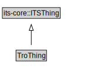

# TroThing

<a href="../../diagrams/itsRegulation__TroThing.dot.svg">Open interactive TroThing diagram</a>

## Specializations of TroThing

| Class | Description |
|-------|-------------|
| [Legal Basis](itsRegulation__LegalBasis.md) | A legal basis provides references to the legal documents that authorize an entity to issue the types of regulations covered by a traffic regulation order. |
| [Rule Maker](itsRegulation__RuleMaker.md) | A rule maker is an entity that has the responsibility for creating and maintaining rules of the road or regulations for a geographic and operational scope as defined by the parent jurisdictional entity. |
| [Traffic Regulation](itsRegulation__TrafficRegulation.md) | A traffic regulation is a rule having the force of law that is established by a regulator through a traffic regulation order. |
| [Traffic Regulation Order](itsRegulation__TrafficRegulationOrder.md) | A TrafficRegulation Order is a legally recognised document that specifies one or more traffic regulations. |

## Formalization for TroThing

| Property | Constraint |
|----------|------------|
| subClassOf | transportnetwork::ITSThing |

## Other annotations

| Annotation | Value |
|------------|-------|
| xsd::pattern | TroPattern |

